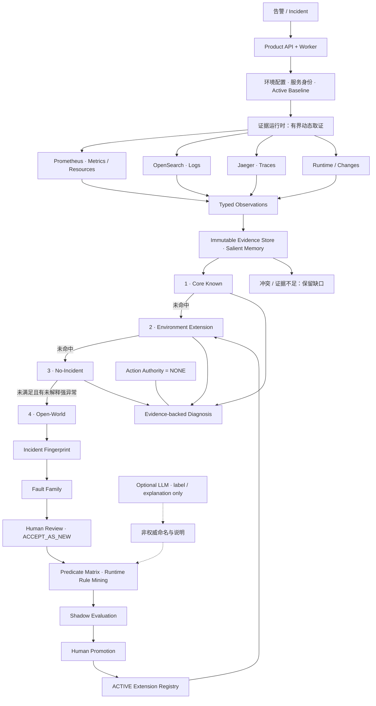

# EcomSRE-Agent

面向微服务故障定位的可验证 SRE Agent：从指标、日志、调用链和运行状态中动态取证；
已知故障走确定性诊断，未知故障经跨事件聚类、人工确认和影子评估后沉淀为环境级规则，
模型不持有执行权限。

*A verifiable, read-only SRE Agent that turns multi-source telemetry into
evidence-backed diagnoses and learns environment-specific fault types through
human-gated shadow evaluation.*

**当前状态：v0.3 已完成 · 只读 Product 原型 · 单租户本地验证**

[](https://github.com/Raidriar7170/EcomSRE-Agent/actions/workflows/agent-mainline.yml)
[](https://github.com/Raidriar7170/EcomSRE-Agent/actions/workflows/rcaeval-v2-dev.yml)

[快速体验](docs/product/QUICKSTART.md) ·
[当前状态](docs/product/STATUS.md) ·
[系统架构](docs/product/ARCHITECTURE.md) ·
[离线 HTML 手册](docs/interview/ecomsre-agent-v03-handbook.html) ·
[最终结果](docs/product/STATUS.md#已验证结果)

> 20 秒看价值，3 分钟看架构，10 分钟沿证据与代码确认边界。
> HTML 手册需下载后在浏览器打开；GitHub 文件页显示的是源码。

## 为什么做这个项目

告警不等于根因。证据分散在指标、日志、调用链和运行状态中：
接口慢可能来自依赖异常，也可能是排队；进程健康也不代表业务没有积压。
数据缺失、采样不全和名称不一致，又会让“没查到”被误读成“没有问题”。

LLM 能组织解释，但也可能编造目标、工具或行动。
这个项目把候选服务、查询边界、证据引用、诊断准入和执行权限
放在确定性 Runtime 中维护，而不是交给模型自由决定。

这里的“Agent”重点是围绕证据完成有边界的诊断流程。
模型是可选的非权威解释层，不是生产环境的执行者。

### 三个核心设计选择

- **先检查证据，再输出结论。** 读取保留来源、窗口、覆盖度与失败状态；
  缺失证据不会被当作健康或反证。
- **已知与未知分路处理。** 已知类型用确定性规则匹配；
  未注册的异常先形成可审查报告，不直接发明可执行的故障类型。
- **知识可以演化，权限不能自动扩张。** 新规则经过故障族、人工门控和影子评估；
  注册后仍然只有只读诊断能力。

## 三阶段演进

| 阶段 | 主要问题 | 已形成的结果 |
| --- | --- | --- |
| 1 · 证据驱动的可靠诊断 | 证据缺失、工具选择不稳定 | 类型化观测、证据缺口、由 Runtime 维护的路由与准入 |
| 2 · 可部署的只读 Product MVP | 研究代码缺少持久化与接入能力 | FastAPI / Worker / SQLite / CAS、真实连接器、Baseline、只读诊断 |
| 3 · 开放世界发现与人引导知识演化 | 已注册类型不能覆盖每个环境 | Open-World → 故障族 → 人工确认 → 规则挖掘 → 影子评估 → 环境扩展 |

详细尝试、失败结果及微版本保留在[项目演进索引](docs/history/PROJECT_EVOLUTION.md)，
不需要先读完整工程历史才能理解当前系统。

## 当前架构

系统分为环境与证据、诊断、知识演化三层。箭头上的“未命中”表示固定顺序，
不是让模型任选一条诊断路线；证据冲突或不足时可以提前停止。



[详细架构](docs/product/ARCHITECTURE.md) ·
[Mermaid 源文件](docs/assets/ecomsre-v03-architecture.mmd) ·
[静态 SVG](docs/assets/ecomsre-v03-architecture.svg)

Runtime 维护候选、谓词、证据引用、覆盖度、匹配与持久化完整性。
可选 LLM 只辅助命名和解释，不能选择晋升关键谓词、批准注册或执行动作。
图中的命名输入不参与规则选择。

### 诊断输出如何理解

- `CORE_KNOWN`：当前证据满足内置故障类型的准入条件。
- `EXTENSION_KNOWN`：命中该环境已激活的扩展规则。
- `NO_INCIDENT`：所需健康证据成立，不是“没有看到报错”。
- `OPEN_WORLD`：有未被现有类型解释的强异常，先生成临时报告。
- `CONFLICTING_EVIDENCE` / `INSUFFICIENT_EVIDENCE`：
  冲突或缺口无法安全消解，保留不确定性。

## 已证明什么

以下是一个有界本地 OpenTelemetry Demo 多服务环境中的结果，
不是跨环境基准、生产可用性承诺或通用根因准确率。

| 验证路径 | 观测到的结果 | 直接证据 |
| --- | --- | --- |
| 健康系统验收 | 30/30 checkout 事务成功；Metrics / Resources / Traces / Logs / Runtime 均有证据；`NO_INCIDENT`；No-Fault `FULLY_SUPPORTED`；能力限制 0 | [健康验收 JSON](docs/results/product-v024-nofault-acceptance-final.json) |
| 未知故障知识闭环 | 3 个 Open-World 窗口形成一个故障族；Runtime 挖掘两源规则；Shadow recall 1.0 / FPR 0.0；新窗口 H1 = `EXTENSION_KNOWN` | [实验 JSON](docs/results/product-v030-live-knowledge-evolution.json) · [故障族与规则](docs/analysis/product-v030-family-and-rule-summary.json) |

**Provider / Agent write / Runbook = 0；action_authority = NONE；cleanup = CLEAN。**
零写入指 Product/Agent 权限与计数；历史实验的故障注入由独立、
显式授权的本地实验控制器完成，不是“环境从未发生过写入”。

### 健康控制为什么重要

健康环境也可能出现短窗口资源波动、少量日志或采样噪声。
系统不能仅凭“出现异常词”或“内存增长”就报告未知故障。

健康验收检查业务事务、五类证据与诊断结果的一致性；
后续知识闭环又以 N0-A / N0-B 两个健康窗口作为负对照，
各 30/30 事务成功并返回 `NO_INCIDENT`。

### 知识演化案例

1. C1 返回 `CORE_KNOWN / CONFIGURATION_ERROR / payment`，
   并提供明确队列阴性证据；无关 Logs / Traces 缺口仍保留。
2. P1 / P2 / P3 返回 `OPEN_WORLD / CONCURRENCY / fraud-detection`，
   没有预先把 Kafka 队列积压作为内置答案。
3. 三个事件组成一个故障族，根服务一致性为 1.0。
4. Runtime 从正负例矩阵中选出：
   `core:RUNTIME_HEALTHY AND ga:METRIC_QUEUE_LAG_OUTLIER`。
5. 影子评估通过，人工门控后仅激活一个 `kafka-queue-backlog` 环境扩展。
6. 留出的新复发窗口 H1 命中该扩展，根服务仍为 `fraud-detection`，
   不再创建临时报告或新故障族。

Shadow 的 1.0 / 0.0 是小样本观测值：
3 个正例和 10 个已评估负向/反事实/失败用例；
`OTHER_EXTENSION` 分层不可用，不能声称已测过与其他扩展的冲突。

完整指标、人工门控执行方式与样本边界见
[知识演化](docs/product/KNOWLEDGE_EVOLUTION.md)和[限制](docs/product/LIMITATIONS.md)。

### 验证与合并状态

Product v0.3 的最终集成 CI：**6,326 passed / 21 documented skips**，
Ruff 通过，mypy 覆盖 669 个源文件，两项 GitHub Actions 工作流通过。
这些数字属于已合并的 Product v0.3，不是本文档修改新跑出的测试数量。

[PR #88 最终完成记录](https://github.com/Raidriar7170/EcomSRE-Agent/pull/88#issuecomment-5529165572)
提供最终 CI 与合并证据。提交的结果 JSON 是集成前快照；
其中 `completion_terminal_minted = false` 不代表当前项目仍未完成。
历史失败不被覆盖，详见[当前状态](docs/product/STATUS.md)。

## 试一试：只选一个入口

### 1. 两分钟证据导览

无需安装依赖或私有文件。打开[健康验收 JSON](docs/results/product-v024-nofault-acceptance-final.json)
看 `traffic`、`diagnosis`、`scorer`；
再打开[故障族与规则摘要](docs/analysis/product-v030-family-and-rule-summary.json)
看 `runtime_selected_clause`、`shadow_evaluation`、`promotion` 与 `h1`。

### 2. Docker-free 确定性演示

在仓库根目录，准备 Python 3.11 与 uv：

```bash
uv sync --frozen --python 3.11
PYTHONPATH=src:. uv run --frozen --no-sync python -m scripts.product.run_product_mvp_demo
```

成功输出 `ECOMSRE_PRODUCT_MVP_V01_KNOWLEDGE_LOOP_PASS`。
历史命名入口在当前代码上运行，覆盖 API、Worker、聚类、模拟人工门控、
影子评估、扩展复发与重启持久化。它使用合成夹具，不连接 Docker 或模型 Provider，
不是 Kafka live 实验的复跑。见[逐步说明](docs/product/QUICKSTART.md#b-docker-free-确定性演示)。

### 3. 进阶本地 OTel 集成

已有隔离环境时，阅读[接入概览](docs/product/QUICKSTART.md#c-进阶本地-otel-集成)
及[运维文档](docs/product/OPERATIONS.md)。
真实接入需要校验服务身份、数据源覆盖和 Active Baseline；
完整 live 知识闭环依赖未公开的镜像锁与保留证据，不是默认 Quickstart。

## 仓库导览

| 路径 | 用途 |
| --- | --- |
| [src/ecomsre/product](src/ecomsre/product) | API、Worker、连接器、Baseline、事件诊断与知识库 |
| [src/ecomsre/dta_v2](src/ecomsre/dta_v2) | 类型化证据、确定性谓词、诊断准入与扩展契约 |
| [tests/product](tests/product) | Product 夹具与边界回归测试 |
| [examples/product](examples/product) | 本地接入配置示例 |
| [docs/product](docs/product) | 当前状态、API、接入与运维说明 |
| [docs/interview/PROJECT_PITCH.md](docs/interview/PROJECT_PITCH.md) | 20 秒 / 90 秒讲法、高频问答与代码路线 |
| [docs/history/PROJECT_EVOLUTION.md](docs/history/PROJECT_EVOLUTION.md) | 历史研究、失败教训与证据索引 |
| [docs/results](docs/results) | 保留的机器结果与解释文档 |

## 限制与下一步

当前证明的是：一个本地环境中的只读诊断和**一个学到的队列积压机制**闭环。
部署仍是单租户 SQLite 原型；没有 Kubernetes、HA、生产规模或跨公司泛化验证。
阈值与故障族相似度依赖本地环境，短窗口健康不等于长期稳定性。

下一步优先验证独立环境和故障机制、其他扩展干扰、
长时间健康负对照与部署可靠性，而不是直接增加执行权限。
完整“已证明 / 未证明”边界见[限制说明](docs/product/LIMITATIONS.md)。

上游 OpenTelemetry Demo 提供被观测环境，本项目提供证据与诊断、
Product 持久化和知识演化流程；不把上游服务算作项目自研功能。
