# EcomSRE-Agent

EcomSRE-Agent is a verifiable, authority-separated Agent runtime for
e-commerce incident diagnosis and replay-only restricted remediation. It uses
a custom lightweight Multi-Agent runtime, typed handoffs, a central budget,
run-scoped evidence, deterministic policy enforcement, and replayable reports.

This repository is an evidence-oriented local research system—not a production
autonomous SRE. Its demos cover the implemented Phase 1–3 path, the separate
Phase 4 Search/Recommendation replay path, and the Phase 5A diagnosis-quality
repair without Docker, live telemetry, or live mutation.

## One-command offline demo

```bash
uv sync --frozen --python 3.11
make agent-demo
```

The command runs the frozen `ad-partial-failure-complete` observer-visible
case through the real Dynamic Multi-Agent workflow and the real Phase 3
restricted-remediation runtime:

```text
Incident
→ Dynamic Multi-Agent diagnosis
→ structured RCA
→ deterministic Remediation Planner
→ Policy Gate
→ local-test approval
→ replay Restricted Executor
→ independent verification
→ REMEDIATION_VERIFIED
```

The concise result is printed to stdout. The complete deterministic report is
written to the ignored path
`artifacts/demo/agent-mainline-v1-report.json`.

Expected boundary markers include:

```text
Diagnosis backend: SCRIPTED_REPLAY
Remediation backend: REPLAY
Approval mode: LOCAL_TEST_AUTO_APPROVAL
Provider called: false
Docker called: false
Live execution: false
```

## One-command Phase 4 domain demo

```bash
make phase4-demo
```

This deterministic `SCRIPTED_REPLAY` demo runs the
`search-feature-freshness-lag-complete` case through the existing Dynamic
Commander and Metrics/Logs/Trace/Change Specialists, then the versioned Phase 4
Domain Judge. It diagnoses `feature` / `feature_freshness_lag` and terminates at
`NO_SUPPORTED_REMEDIATION` with `remediation_backend = NONE` and
`live_mutation = false`.

Phase 4 adds five visible Search/Recommendation templates over Feature and
Ranking evidence. Its three new mechanisms are `feature_freshness_lag`,
`model_feature_schema_mismatch`, and `ranking_configuration_failure`. It does
not add an Agent, a live Feature/Ranking service, or a remediation action.

## One-command Phase 5A missing-telemetry demo

```bash
make phase5a-demo
```

This deterministic `SCRIPTED_REPLAY` demo discovers the visible template with
an unavailable Logs source, runs Dynamic Multi-Agent v2, and preserves that
source as a typed missing-evidence finding. Metrics and Traces still support
`ad` / `request_processing_failure`; the workflow completes without a fallback,
remediation action, Docker call, or live mutation.

Phase 5A also provides a 12-template × 3-variant visible development report:

```bash
make phase5a-compare
make phase5a-verify
```

The report is explicitly `VISIBLE DEVELOPMENT EVALUATION` and
`NOT A SUPERIORITY CLAIM`. Phase 5B v1 later completed all 180 frozen main
runs, but v1 scoring was terminated because hidden difficult-subset metadata
did not satisfy the frozen analysis contract. Phase 5B v2 repaired only that
analysis-time projection over the identical immutable execution evidence and
froze `NO_PREREGISTERED_ADVANTAGE_SUPPORTED`, with no Provider, Agent, or
scored-run reruns.
The bounded real-provider pilot reached 9/9 protocol acceptance and 8/9 semantic
acceptance. Its 9/9 gate is `NOT PASSED`; no Multi-Agent superiority is claimed.

## Architecture

```mermaid
flowchart LR
    I["Incident"] --> D["Single / Fixed / Dynamic diagnosis"]
    D --> E["Run-scoped Evidence Store"]
    E --> J["RCA Judge"]
    J --> H["Typed Diagnosis Handoff"]
    H --> P["Deterministic Remediation Planner"]
    P --> G["Policy Gate"]
    G --> A["Human or explicit local-test approval"]
    A --> X["Restricted Executor"]
    X --> V["Independent Verifier"]
    V -->|"verified"| R["Terminal report"]
    V -->|"failed / inconclusive"| B["Exact compensating rollback"]
    B --> R

    classDef agent fill:#e8f1ff,stroke:#2457a7,color:#102a43;
    classDef deterministic fill:#eaf8ee,stroke:#237a3b,color:#123d20;
    class D,J agent;
    class E,H,P,G,A,X,V,B,R deterministic;
```



The Commander, Specialists, and RCA Judge are the Agent-facing diagnosis
components. Evidence resolution, budgets, handoffs, planning, policy,
execution, verification, and rollback are typed deterministic components. An
LLM or scripted model may propose only through its admitted response contract;
it cannot expand the Policy Gate or Executor authority.

## Current status

| Phase | Current truth |
| --- | --- |
| Phase 0 | `REVIEW_REQUIRED`; canonical acceptance is **not complete** and the historical `UNSAFE / FAILED / BLOCKED` evidence is preserved |
| Phase 1 | `PHASE1_SINGLE_AGENT_REPLAY_MVP_READY` |
| Phase 2 | `PHASE2_MULTI_AGENT_REPLAY_MVP_READY`; offline comparison and bounded provider gate verified, with no superiority claim |
| Phase 3 | `PHASE3_RESTRICTED_REMEDIATION_REPLAY_MVP_READY`; replay-only |
| Phase 4 | `PHASE4_OFFLINE_ECOMMERCE_DOMAIN_REPLAY_MVP_READY`; deterministic offline replay verified, real-provider gate `SKIPPED_NOT_CONFIGURED` |
| Phase 5A | `PHASE5A_MULTI_AGENT_QUALITY_REPAIR_READY`; offline quality repair `PASS`; provider protocol 9/9, semantic pilot 8/9, real-provider 9/9 gate `NOT PASSED`; no superiority claim |
| Phase 5B | `PHASE5B_V2_FINAL_REPORT_FROZEN`; v1 completed 180/180 frozen main runs and was irreversibly unblinded, v1 scoring terminated on a metadata-contract mismatch, and v2 analysis-only scoring reused the same records with Provider/Agent/scored-run reruns `0`; final claim `NO_PREREGISTERED_ADVANTAGE_SUPPORTED` |
| E2E v6 original | `BLOCKED_E2E_V6_UNCLASSIFIED_RUNTIME_FAILURE`; Provider preflight passed, but the run ended before Compose start; fault/model/mutation counts `0/0/0`; the original result remains preserved |
| E2E v6 `V6_REPRO_1` | One accepted local run injected the frozen payment fault and passed Fault Impact plus Metrics/Logs/Traces availability, then stopped before A0 because the diagnostic journal rejected a backward stage transition; final public terminal `BLOCKED_PUBLIC_RESULT_VERIFICATION`; A0/model/forward mutation `0/0/0`; baseline restored and cleanup `CLEAN` |
| E2E v6 `V6_REPRO_2` | One accepted local run proved the repaired ordered source-stage transition and reached `MULTISERVICE_PROJECTION_COMPLETED`, where a typed projection runtime failure stopped the run before diagnosis; final public terminal `BLOCKED_PUBLIC_RESULT_VERIFICATION`; A0 builder/model/forward mutation `1/0/0`; baseline restored and cleanup `CLEAN` |
| E2E v6 `V6_REPRO_3` | One accepted local run completed the bounded projection and one A0 model diagnosis, but the diagnosis was incorrect; terminal `LIVE_DIAGNOSIS_GATE_NOT_PASSED_NO_REMEDIATION`; forward/rollback mutation `0/0`; baseline restored and cleanup `CLEAN` |

### V6_REPRO_2 accepted-run boundary

| Gate | Status |
| --- | --- |
| 25-service Sandbox | Completed |
| Human approval | Completed with a new exact R2 record |
| Fault injection | Completed once with the frozen payment fault |
| Fault Impact | Passed |
| Metrics / Logs / Traces | `AVAILABLE / AVAILABLE / AVAILABLE`; counts `5 / 40 / 18`; invalid refs `0` |
| Ordered source-stage repair | Passed; `SOURCE_AVAILABILITY_GATE_EVALUATED` was followed by `MULTISERVICE_PROJECTION_STARTED` without replaying source stages |
| Last reached stage | `MULTISERVICE_PROJECTION_COMPLETED` failed; bounded projection recorded diagnostic counts `8 / 0 / 12` for Metrics / Logs / Traces |
| A0 diagnosis | Not reached; live model calls `0` |
| Restricted remediation | Not reached; forward mutations `0` |
| Recovery verification | Not reached |
| Cleanup | Completed; baseline restored and owned resources `0 / 0 / 0` |
| Production autonomy | Not claimed |

### V6_REPRO_3 accepted-run boundary

| Gate | Status |
| --- | --- |
| 25-service Sandbox | Completed |
| Human approval | Completed with a new exact R3 record |
| Fault injection | Completed once with the frozen payment fault |
| Fault Impact | Passed |
| Metrics / Logs / Traces | `AVAILABLE / AVAILABLE / AVAILABLE`; source counts `5 / 24 / 12`; invalid refs `0` |
| Bounded projection | Completed; diagnostic counts `8 / 0 / 14`, visible services `4`, and all selected refs resolved |
| A0 diagnosis | Executed once from the sealed fault-time context; Diagnosis Gate failed because the diagnosis was incorrect |
| Restricted remediation | Not entered; forward mutations `0` |
| Recovery verification | Not reached |
| Cleanup | Completed; baseline restored and owned resources `0 / 0 / 0` |
| Terminal | `LIVE_DIAGNOSIS_GATE_NOT_PASSED_NO_REMEDIATION`; preserved as a legal negative result |
| Production autonomy | Not claimed |

The authoritative detail lives in the [Roadmap](docs/ROADMAP.md),
[Decision Register](docs/DECISIONS.md),
[Phase 0 acceptance contract](docs/PHASE_0_ACCEPTANCE.md),
[Phase 2 closeout](docs/PHASE_2_CLOSEOUT.md), and
[Phase 3 disposition](docs/review-evidence/phase3-restricted-remediation/current-disposition.json), and
[Phase 4 disposition](docs/review-evidence/phase4-ecommerce-domain-replay/current-disposition.json), and
[Phase 5A disposition](docs/review-evidence/phase5a-multi-agent-quality/current-disposition.json).
The Phase 5B protocol boundary is recorded in
[DEC-028](docs/DECISIONS.md), while the out-of-band seal control plane and
authoritative-pack replacement rule are recorded in
[DEC-029](docs/DECISIONS.md). The compact boundary is recorded in the
[Phase 5B protocol disposition](docs/review-evidence/phase5b-protocol/current-disposition.json).
The answer-free aggregate binding for the external pack is recorded in the
[Phase 5B hidden-pack disposition](docs/review-evidence/phase5b-hidden-pack/current-disposition.json).
The v1 scoring termination is recorded in the
[Phase 5B v1 termination disposition](docs/review-evidence/phase5b-v1-termination/current-disposition.json).
The frozen v2 aggregate report and exact public claim are recorded in the
[Phase 5B v2 final summary](docs/results/phase5b-v2-final-summary.md) and
[Phase 5B v2 final disposition](docs/review-evidence/phase5b-v2-final/current-disposition.json).

## Evidence boundaries

The phases intentionally make different claims:

| Surface | Evidence-backed boundary |
| --- | --- |
| Phase 1 scripted replay | 7 frozen observer-visible cases |
| Phase 1 real-provider gate | 2 bounded cases: one positive and one negative |
| Phase 2 offline comparison | 7 cases × 3 variants: Single, Fixed, and Dynamic |
| Phase 2 real-provider gate | 4 bounded Fixed/Dynamic positive/negative runs |
| Phase 3 remediation | 6 deterministic replay cases; no Docker, provider, or live mutation |
| Phase 4 domain replay | 5 new cases × 2 variants: Fixed and Dynamic; no superiority claim |
| Phase 4 real-provider gate | 4 bounded positive/negative Fixed/Dynamic runs when configured; otherwise `SKIPPED_NOT_CONFIGURED` |
| Phase 5A visible development evaluation | 12 public cases × 3 capability-parity v2 variants; all 36 runs retained; no superiority claim |
| Phase 5A real-provider pilot | 3 visible cases × 3 variants; protocol 9/9, semantic acceptance 8/9; `BLOCKED_PROVIDER_PILOT_AFTER_ROOT_CAUSE_FIX` |
| Phase 5B v1 frozen execution | 6 public anchors + 6 opaque hidden slots × 5 paired seeds × 3 arms = 180/180 terminal main records; 38/38 frozen ablation-gap records; all failures retained; irreversibly unblinded |
| Phase 5B v2 analysis-only result | Identical immutable v1 records; hidden-only Dynamic/Single Decision Accuracy 63.3%/53.3%, difference +10.0 pp with 95% hierarchical paired CI [−16.7 pp, +36.7 pp]; Provider/Agent/scored-run reruns 0; `NO_PREREGISTERED_ADVANTAGE_SUPPORTED` |
| Phase 5B mock dry run | 2 synthetic templates × 2 seeds × 3 arms; `NOT_MODEL_EVIDENCE`; Provider calls 0 |
| Live E2E v6 R1 | One local accepted fault-time run; Provider preflight 1, fault injection 1, fault impact PASS, Metrics/Logs/Traces 5/32/16, A0/model/mutation 0/0/0, cleanup `CLEAN`; exact negative result in [the R1 public report](docs/results/live-fault-a0-controlled-remediation-e2e-v6-repro-1.md) |
| Live E2E v6 R3 | One local accepted fault-time run; Provider preflight PASS, fault injection 1, fault impact PASS, Metrics/Logs/Traces 5/24/12, A0/model/forward mutation 1/1/0, Diagnosis Gate false, cleanup `CLEAN`; exact legal negative result in [the R3 public report](docs/results/live-fault-a0-controlled-remediation-e2e-v6-repro-3.md) |
| Agent Mainline V1 demo | One deterministic scripted replay integration case; not an evaluation or provider result |

The Phase 1 real-provider result is **not** 7/7.
The Phase 2 comparison does not establish Multi-Agent superiority.
Provider-smoke reports are bounded gates and are not silently substituted for
the offline comparison.

Observer-visible case files and evaluator-only truth use separate roots. The
demo loads only `config/phase1/replay-cases/agent-visible`; it does not import or
read evaluator ground truth. Reports contain typed summaries and semantic
digests, not raw provider transcripts, credentials, authorization headers, or
host-absolute paths.

## Quickstart and verification

Python 3.11 is explicit because the frozen `tiktoken==0.13.0` dependency is
locked to a cp311 wheel on the supported local platform.

```bash
uv sync --frozen --python 3.11

# Public integration path
make agent-demo

# Focused phase checks
make phase1-test
make phase2-test
make phase3-test
make phase4-test

# Recompute and verify deterministic reports
make phase2-compare
make phase2-verify
make phase3-replay
make phase3-verify
make phase4-compare
make phase4-verify
make phase4-demo
make phase4-provider-smoke
make phase5a-test
make phase5a-compare
make phase5a-verify
make phase5a-demo
make phase5a-provider-pilot

# Offline-only Phase 5B protocol checks (never call the Provider)
make phase5b-test
make phase5b-preflight
make phase5b-protocol-verify
make phase5b-schedule
make phase5b-dry-run
make phase5b-dry-run-verify
make phase5b-hidden-pack-contract-test
make phase5b-hidden-pack-verify PHASE5B_HIDDEN_PACK_ROOT=/external/path
make phase5b-hidden-pack-seal-verify
```

No provider configuration is needed for the tests, comparisons, verifiers, or
demos above. The Phase 4 provider smoke and Phase 5A provider pilot return
`SKIPPED_NOT_CONFIGURED` when their complete provider environment is absent.
Provider runs are separately reported gates and are not part of a demo or CI.

## Results

The current integration baseline records:

| Check | Result |
| --- | ---: |
| Phase 1 tests | 877 passed |
| Phase 2 tests | 379 passed |
| Phase 3 tests | 27 passed |
| Phase 4 tests | 63 passed |
| Phase 5A tests | 74 passed |
| Agent Mainline V1 demo tests | 8 passed |
| Full repository tests | 2,265 passed |
| Phase 2 comparison | 7 × 3 report verified |
| Phase 2 real-provider gate | 4 bounded requirements passed |
| Phase 3 replay evaluation | 6 cases verified |
| Phase 4 domain comparison | 5 × 2 deterministic report verified |
| Phase 4 real-provider gate | `SKIPPED_NOT_CONFIGURED` on the offline branch |
| Phase 5A capability-parity report | 12 × 3 visible development report verified; Single/Fixed/Dynamic v2 original-seven accuracy 7/7 each |
| Phase 5A real-provider pilot | Protocol 9/9; semantic acceptance 8/9; real-provider 9/9 gate `NOT PASSED` |
| Phase 5B v2 final analysis | v1 180/180 frozen main records reused; v2 hidden-only paired analysis and 10,000-replicate bootstrap frozen; additional Provider calls 0; final claim `NO_PREREGISTERED_ADVANTAGE_SUPPORTED`; 38 ablation slots remain `NOT_IMPLEMENTED` and are not model evidence |
| Phase 5B dry run | 12 deterministic synthetic runs verified; Provider calls 0; `NOT_MODEL_EVIDENCE` |

These counts are development evidence for the named revision. They are not a
release, production-readiness, Phase 0 acceptance, or model-quality claim.

## Why a custom runtime?

- **Typed handoffs instead of free-form agent chat.** Commander, Specialists,
  Judge, and remediation consume closed Pydantic contracts with run and
  incident identity checks.
- **One central budget boundary.** Single, Fixed, and Dynamic variants share
  the same outer model-call, tool-call, and token caps so orchestration is not
  treated as free.
- **Deterministic authority after diagnosis.** Planner, Policy Gate, approval
  binding, Restricted Executor, Verifier, and rollback are not LLM agents.
- **Run-scoped evidence capabilities.** Agents cite evidence references that
  must resolve to immutable bodies in the current run's Evidence Store.
- **Small, inspectable core.** The project does not depend on LangGraph,
  CrewAI, or AutoGen for orchestration; it implements only the scheduling,
  budget, evidence, and authority contracts required by its evaluation.

## Repository map

```text
src/ecomsre/phase1/   Single-Agent RCA and read-only evidence contracts
src/ecomsre/phase2/   Fixed/Dynamic workflows, Commander, Specialists, Judge
src/ecomsre/phase3/   Planner, Policy Gate, replay executor, verifier, rollback
src/ecomsre/phase4/   Search/Recommendation Domain RCA, evaluation, provider gate
src/ecomsre/phase5a/  Capability-parity v2 diagnosis policy and evaluation
src/ecomsre/demo/     Thin public Phase 2 → Phase 3 offline integration
config/phase1/        Frozen seven-case observer-visible replay baseline
config/phase4/        Five independent domain replay cases
eval/                 Evaluator-only scoring surfaces; never read by the demo
tests/                 Contract, replay, isolation, and regression checks
```

## Limitations

- Phase 0's live environment has not passed canonical acceptance.
- Remediation is process-local and replay-only; it does not write Docker,
  feature flags, cloud systems, or production resources.
- The public demo uses an evidence-driven deterministic scripted backend. It
  exercises integration behavior but does not replace the frozen Phase 2
  comparison baseline or the bounded real-provider gate.
- Phase 4 is replay-only. Its provider gate is bounded and currently
  unconfigured; it does not substitute scripted output for provider output.
- Phase 5A uses public development templates. Its 7/7 v2 results are a bounded
  quality-repair result, not a hidden-set or superiority claim.
- Phase 5B v2 did not establish a preregistered accuracy or cost-quality
  advantage. Its 38 ablation gap slots are not implemented, not model evidence,
  and not ablation results.
- No production write capability, live remediation, release, or deployment is
  claimed.

See [Safety Boundaries](docs/SAFETY_BOUNDARIES.md) for the permanent
prohibitions and exact authority model.
