# EcomSRE-Agent

EcomSRE-Agent is a verifiable, authority-separated Agent runtime for
e-commerce incident diagnosis and bounded restricted remediation. It contains
Single-Agent and Multi-Agent diagnosis paths, typed handoffs, central budgets,
run-scoped evidence, deterministic policy enforcement, and replayable reports.

This repository is an evidence-oriented local research system—not a production
autonomous SRE. Its default Phase 1–5 demos are offline/replay-only. A separate
LOCAL_DEMO successor proved one known local Payment configuration restoration;
its strict R3 diagnosis remained negative because of a fault-class mismatch.
That bounded result is not general live-remediation or production evidence.

<!-- dta-v21-pr-f-final-capability-closeout -->
### DTA v2.1 frozen-Agent capability closeout

DTA v2.1 preserved a negative held-out result and two valid live Agent
capability failures. No-Fault produced a false-positive Diagnosis but safe
`NO_ACTION`. Ad CPU terminated on a duplicate read request before Diagnosis or
Action Selection. No Agent write occurred, all valid attempts restored baseline
and cleaned owned resources, and no further execution was performed. The result
is `DTA_V21_P0_ENGINEERING_CLOSEOUT_WITH_FROZEN_AGENT_CAPABILITY_LIMITATIONS`, not a live recovery success.
<!-- /dta-v21-pr-f-final-capability-closeout -->

### DTA v2.2 practical controller evaluation

DTA v2.2 recovered the runtime-owned controller core behind the blocked strict
research PR #60, added a simple H/A/E Provider adapter, and completed one fixed
12-case replay comparison without Docker, Runbooks, live remediation, or Agent
writes. Planner-Lite produced 3/12 end-to-end exact outcomes versus Flat's 1/12
and met the small practical threshold (mechanism Macro-F1 0.1333 versus 0.0,
equal mean reads, post-repair protocol success 1.0). Absolute quality remained
weak, so this is an interview portfolio result—not a research, generalization,
or production claim. See the [fixed evaluation](docs/results/dta-v22-practical-evaluation.md),
[error analysis](docs/results/dta-v22-practical-error-analysis.md), and
[interview brief](docs/results/dta-v22-practical-interview-brief.md).

DTA v2.2.1 then tested one narrow premature-abstention gate in a single fixed
12-case × 4-combination study. Gate variants read more, but neither gated arm
met every preregistered acquisition threshold, no read produced a correct
Diagnosis, and no Planner-specific interaction was established. The result is
`DTA_V22_1_NO_EVIDENCE_ACQUISITION_EFFECT_OBSERVED`; all 48 runs were
represented with zero Agent writes. See the [study](docs/results/dta-v22-1-evidence-acquisition-study.md),
[error analysis](docs/results/dta-v22-1-evidence-acquisition-error-analysis.md),
and [interview brief](docs/results/dta-v22-1-evidence-acquisition-interview-brief.md).

DTA v2.2.2 replaced that gate experiment with source-aware predicate-gap
routing and ran one new 16-case × 4-combination synthetic/derived replay study.
Exact completion was Flat Broad 6/16, Flat Gap 10/16, Planner Broad 6/16, and
Planner Gap 8/16. The preregistered measured result terminal is
`DTA_V22_2_GAP_ROUTING_QUALITY_EFFECT_OBSERVED`: Planner Gap gained two exact
cases, mechanism Macro-F1 rose from 0 to 0.2667, diagnosis-after-read rose from
0 to 0.1538, and combined No-Incident/abstention accuracy stayed at 1.0.
Planner-specific interaction was not established. Absolute incident quality
remained weak, and CPU/memory cases exposed premature `NO_INCIDENT` admission
before unread resource evidence, so this is bounded replay evidence—not a
generalization, live-operation, or production claim. See the [fixed study](docs/results/dta-v22-2-gap-routing-evaluation.md),
[error analysis](docs/results/dta-v22-2-gap-routing-error-analysis.md), and
[interview brief](docs/results/dta-v22-2-gap-routing-interview-brief.md).

DTA v2.2.3 tested two narrower follow-ups on a new 16-case × 4-combination
synthetic/derived replay set: one gap-relevant read before otherwise-admissible
`NO_INCIDENT`, and deterministic runtime dispatch of ranking[0]. All 64 runs
were represented once with zero Agent writes and zero runner exceptions. Closed
admission improved exact completion only from 12/16 to 13/16; resource-silent
accuracy reached 1/4 and premature `NO_INCIDENT` remained 3/4. Runtime Top-1
did not improve exact completion or oracle-path hit over Model Top-4 selection,
although it removed 46 Provider calls and 33,866 tokens in the pooled dispatch
comparison. The preregistered result is therefore
`DTA_V22_3_NO_FIX_EFFECT_OBSERVED`, not a quality or generalization success.
See the [fixed study](docs/results/dta-v22-3-admission-dispatch-evaluation.md),
[error analysis](docs/results/dta-v22-3-admission-dispatch-error-analysis.md),
and [interview brief](docs/results/dta-v22-3-admission-dispatch-interview-brief.md).

DTA v2.2.4 remains a closed, unmerged `INVALID` predecessor on PR #65 because
its Provider-visible identities, closure accounting, and preflight binding did
not support a causal claim. DTA v2.2.5 used new opaque case bytes and repaired
all three boundaries before one independently reviewed 16-case x 4-combination
successor study. TARGET_ONE completed 12/16 exactly, TARGET_SET 16/16,
BUNDLE_ONE 16/16, and BUNDLE_SET 15/16; all 64 runs are represented once, with
zero fail-open `NO_INCIDENT`, forgotten pre-closure reads, runner exceptions,
or Agent writes. One BUNDLE_SET terminal selection ended in a preserved
transport failure. The pooled preregistered closure and bundle thresholds did
not pass, so the measured result is
`DTA_V22_5_NO_AMBIGUITY_EFFECT_OBSERVED`, not a positive ambiguity,
generalization, or production claim. See the [fixed study](docs/results/dta-v22-5-opaque-ambiguity-evaluation.md),
[error analysis](docs/results/dta-v22-5-opaque-ambiguity-error-analysis.md), and
[interview brief](docs/results/dta-v22-5-opaque-ambiguity-interview-brief.md).

DTA v2.2.5 then ran one bounded real-fault transfer study comparing the current
runtime-guided BUNDLE_ONE path with a v2-style Flat Adaptive baseline using the
v2.1 CPU-capable ontology—not the exact frozen historical v2 identity. One
owned Sandbox lifecycle produced one baseline and one verified Ad
CPU-saturation capture, rendered through two opaque swapped maps for four
paired cases and eight snapshot arm-runs. Both arms finished 0/4 exact and all
runs were protocol-failed; Current also recorded no successful bundle read in
its live baseline and live fault shadows, so the frozen transfer terminal is
`DTA_V225_REAL_FAULT_TRANSFER_NOT_SUPPORTED`.
`CURRENT_RUNTIME_DESCRIPTIVE_ADVANTAGE` is only the preregistered cost
disposition caused by fail-closed no-read/no-Provider behavior, not a
diagnostic, causal, or statistical advantage. Exact baseline restoration,
`CLEAN` owned cleanup, zero non-owned changes, and zero Agent writes,
ActionProposals, or Runbooks were proven.

DTA v2.2.6 preserved that negative result and used its exact real captures only
as development fixtures. It replaced strict metric-signature ambiguity with a
target-complete Resource Comparison Set and compared model-directed free
source/target selection against runtime-guided contrastive acquisition under
one shared terminalizer. This is not the exact frozen historical v2 Agent. One
new owned Ad CPU campaign produced two physical states, two opaque swapped maps,
two exact Current live shadows, and one fixed eight-run paired execution. Both
arms were 4/4 protocol-valid; Current was 4/4 exact while Model-directed was
0/4 exact after four valid Abstain terminals. Current used 4 versus 12 Provider
calls and 2,562 versus 9,116 tokens. The bounded result is
`DTA_V226_CURRENT_REAL_FAULT_TRANSFER_SUPPORTED` with
`CURRENT_RUNTIME_ACQUISITION_ADVANTAGE`, exact baseline restoration, `CLEAN`
cleanup, zero non-owned changes, and zero write authority. See the
[study](docs/results/dta-v226-real-fault-comparison.md),
[error analysis](docs/results/dta-v226-real-fault-error-analysis.md), and
[interview brief](docs/results/dta-v226-real-fault-interview-brief.md).

### DTA v2.3: separate open-world discovery lane

DTA v2.3 keeps the v2.2 closed-world Diagnosis path unchanged and adds a
separate replay-only lane for residual anomaly discovery, bounded generic
reads, typed provisional incident reports, human review, and shadow
registration. Provisional reports have `action_authority = NONE` and cannot
enter Candidate Filter or Runbook paths; automated review examples use the
simulated `TEST_REVIEWER` identity.

The valid 24-case × 2-arm comparison executed once after an independent-review
repair. Closed arms contain no Graph, Gate, Negative Coverage, generic reads,
or provisional reports; all pairs share the actual v2.2 Diagnosis admission,
and registered-known accuracy stayed 4/4 in both arms. The measured terminal
is `DTA_V23_OPEN_WORLD_DISCOVERY_NOT_OBSERVED`: novelty recall and root
localization were 6/14 (`0.429`), below the frozen mixed-result threshold,
while evidence-ref validity was `1.000`, false-novel rate was `0.100`, and
action-authority violations were zero. The earlier mixed artifact remains
separately preserved as `INVALID / REVIEW_REQUIRED`; a two-pair, zero-Provider
schedule attempt is retained as `PROTOCOL_BLOCKED / INVALID`. No result
establishes production autonomy, remediation authority, or general live-fault
discovery. See the [artifact report](docs/results/dta-v23-open-world-evaluation.md),
[error analysis](docs/results/dta-v23-open-world-error-analysis.md),
[interview brief](docs/results/dta-v23-open-world-interview-brief.md), and
[independent review](docs/external-reviews/dta-v23-open-world-final-review.md).

### DTA v2.3.1: conflict-aware novelty resolution

DTA v2.3.1 adds typed interpretation clusters, conflict assessment, one bounded
discriminating read, evidence-backed competing hypotheses, and compatible
Human Review / Shadow Registry projections without changing the v2.2 Diagnosis
path. The new fixed 24-case × 2-arm comparison executed exactly once. Its
frozen measured terminal is `DTA_V231_CONFLICT_AWARE_DISCOVERY_NOT_OBSERVED`:
treatment novelty recall rose from `0.429` to `0.643`, but conflict-prone recall
was only `0.375`; evidence-ref validity remained `1.000`, and action-authority
violations remained zero.

The execution also exposed an evaluation-data contract failure: the four cases
designated genuinely unregistered were admitted as registered dependency
latency, and the three irreconcilable controls were intercepted by the known
terminal. The one-shot artifact is preserved, but engineering status is
`BLOCKED_DTA_V231_EVALUATION_DATA`; it is not a clean causal effect claim and
was not rerun. See the [artifact report](docs/results/dta-v231-conflict-aware-evaluation.md),
[error analysis](docs/results/dta-v231-conflict-aware-error-analysis.md), and
[interview brief](docs/results/dta-v231-conflict-aware-interview-brief.md), plus
the [independent final review](docs/external-reviews/dta-v231-conflict-aware-final-review.md).

A separately authorized independent successor preserved that consumed study,
froze new evaluation bytes, passed deterministic data admission as
`DTA_V231_SUCCESSOR_EVALUATION_DATA_PASS`, and passed the required pre-execution
`Must Fix 0 / Claim Accuracy PASS` review. Its unique write-once execution
started but did not complete: 12/24 case pairs were persisted before the frozen
v2.3 strict arm failed on `vx-113` with `KeyError: LOG_ERROR_CLUSTER`. No final
successor metrics or measured terminal exist, and the exact repository status
is `BLOCKED_DTA_V231_REPOSITORY_ACCEPTANCE`, not a rerun, effect claim, or
engineering completion. See the [blocked successor evidence](docs/results/dta-v231-successor-evaluation-blocked.md),
[post-execution review](docs/external-reviews/dta-v231-successor-post-execution-review.md),
and [Goal completion audit](docs/analysis/dta-v231-goal-completion-audit.md).

### DTA v2.3.2: total interpretation and measured successor

DTA v2.3.2 preserves both consumed v2.3.1 attempts and does not continue or
rerun them. It adds an enum-total anomaly interpretation registry shared by the
strict and conflict-aware arms. `LOG_ERROR_CLUSTER` is resolved through bound
`LogCategoryV22` evidence, while missing categories map to `UNKNOWN` and
`SOURCE_COVERAGE_GAP` remains coverage state rather than mechanism evidence.
Fresh 24-case bytes passed `DTA_V232_SUCCESSOR_EVALUATION_DATA_PASS`; all 48
deterministic dry-run arms then passed
`DTA_V232_RUNTIME_TOTALITY_PREFLIGHT_PASS` with zero Provider calls, runtime
exceptions, `KeyError`, unmapped kinds, schema failures, premature truth reads,
or authority violations.

The new 24-case × 2-arm study executed exactly once and completed. Its frozen
measured terminal is `DTA_V232_CONFLICT_AWARE_DISCOVERY_MIXED_RESULT`:
treatment novelty recall rose from `0.286` to `0.929`, conflict-prone recall
rose from `0.000` to `0.875`, root localization was `0.857`, and evidence-ref
validity was `1.000`. The result is not positive effect because broad-domain
accuracy was only `0.143` and two irreconcilable controls were converted to
novelty. Registered-known and No-Incident accuracy remained perfect in both
arms; action-authority violations remained zero. See the
[artifact report](docs/results/dta-v232-conflict-aware-evaluation.md),
[error analysis](docs/results/dta-v232-conflict-aware-error-analysis.md),
[interview brief](docs/results/dta-v232-conflict-aware-interview-brief.md), and
[pre-execution review](docs/external-reviews/dta-v232-pre-execution-review.md),
plus the [independent final review](docs/external-reviews/dta-v232-final-review.md).

### DTA v2.3.3: runtime-bound domain projection and witness guard

DTA v2.3.3 targets exactly the two measured v2.3.2 P0 defects. It adds a
runtime-only domain projection, typed contradiction witnesses, an
irreconcilable guard with at most one shared-budget directed read, and minimal
Provider synthesis. Root service, broad domain, evidence references, witness
state, confidence bounds, and `action_authority = NONE` are rebuilt from
runtime-owned objects rather than accepted from the Provider. Known and
No-Incident terminals remain prioritized, while strong coverage-satisfied
contradictions suppress Provider synthesis.

Fresh opaque 28-case bytes passed `DTA_V233_EVALUATION_DATA_PASS`; the 84-path
deterministic gate passed `DTA_V233_RUNTIME_PREFLIGHT_PASS` with zero Provider
calls, runtime exceptions, premature truth reads, or authority violations. The
12-case Provider smoke passed after two bounded real fixes, with zero
root/domain/evidence drift. The independent pre-execution review recorded
`Must Fix 0 / Claim Accuracy PASS`.

The fixed 28-case × 3-arm comparison then executed exactly once. Domain-bound
accuracy improved from `0.125` to `0.625`, root localization improved from
`0.938` to `1.000`, and top-two domain recall reached `0.875`. The combined
witness guard improved irreconcilable-control accuracy from `0/4` to `4/4`,
reduced false novelty to `0.000`, and blocked no novelty cases. Registered-known
and No-Incident accuracy remained perfect; action-authority violations remained
zero. The frozen measured terminal is
`DTA_V233_DOMAIN_AND_GUARD_MIXED_RESULT`, not positive effect, because exact
broad-domain accuracy missed the predeclared `0.650` gate by one case. See the
[artifact report](docs/results/dta-v233-domain-guard-evaluation.md),
[error analysis](docs/results/dta-v233-domain-guard-error-analysis.md),
[interview brief](docs/results/dta-v233-domain-guard-interview-brief.md), and
[pre-execution review](docs/external-reviews/dta-v233-pre-execution-review.md),
plus the [independent final review](docs/external-reviews/dta-v233-final-review.md).

## One-command offline demo

```bash
uv sync --frozen --python 3.11
make agent-demo
```

The command runs the frozen `ad-partial-failure-complete` observer-visible
case through the real Dynamic Multi-Agent workflow and the real Phase 3
restricted-remediation runtime:

```text
Incident
→ Dynamic Multi-Agent diagnosis
→ structured RCA
→ deterministic Remediation Planner
→ Policy Gate
→ local-test approval
→ replay Restricted Executor
→ independent verification
→ REMEDIATION_VERIFIED
```

The concise result is printed to stdout. The complete deterministic report is
written to the ignored path
`artifacts/demo/agent-mainline-v1-report.json`.

Expected boundary markers include:

```text
Diagnosis backend: SCRIPTED_REPLAY
Remediation backend: REPLAY
Approval mode: LOCAL_TEST_AUTO_APPROVAL
Provider called: false
Docker called: false
Live execution: false
```

## One-command Phase 4 domain demo

```bash
make phase4-demo
```

This deterministic `SCRIPTED_REPLAY` demo runs the
`search-feature-freshness-lag-complete` case through the existing Dynamic
Commander and Metrics/Logs/Trace/Change Specialists, then the versioned Phase 4
Domain Judge. It diagnoses `feature` / `feature_freshness_lag` and terminates at
`NO_SUPPORTED_REMEDIATION` with `remediation_backend = NONE` and
`live_mutation = false`.

Phase 4 adds five visible Search/Recommendation templates over Feature and
Ranking evidence. Its three new mechanisms are `feature_freshness_lag`,
`model_feature_schema_mismatch`, and `ranking_configuration_failure`. It does
not add an Agent, a live Feature/Ranking service, or a remediation action.

## One-command Phase 5A missing-telemetry demo

```bash
make phase5a-demo
```

This deterministic `SCRIPTED_REPLAY` demo discovers the visible template with
an unavailable Logs source, runs Dynamic Multi-Agent v2, and preserves that
source as a typed missing-evidence finding. Metrics and Traces still support
`ad` / `request_processing_failure`; the workflow completes without a fallback,
remediation action, Docker call, or live mutation.

Phase 5A also provides a 12-template × 3-variant visible development report:

```bash
make phase5a-compare
make phase5a-verify
```

The report is explicitly `VISIBLE DEVELOPMENT EVALUATION` and
`NOT A SUPERIORITY CLAIM`. Phase 5B v1 later completed all 180 frozen main
runs, but v1 scoring was terminated because hidden difficult-subset metadata
did not satisfy the frozen analysis contract. Phase 5B v2 repaired only that
analysis-time projection over the identical immutable execution evidence and
froze `NO_PREREGISTERED_ADVANTAGE_SUPPORTED`, with no Provider, Agent, or
scored-run reruns.
The bounded real-provider pilot reached 9/9 protocol acceptance and 8/9 semantic
acceptance. Its 9/9 gate is `NOT PASSED`; no Multi-Agent superiority is claimed.

## Architecture

```mermaid
flowchart LR
    I["Incident"] --> D["Single / Fixed / Dynamic diagnosis"]
    D --> E["Run-scoped Evidence Store"]
    E --> J["RCA Judge"]
    J --> H["Typed Diagnosis Handoff"]
    H --> P["Deterministic Remediation Planner"]
    P --> G["Policy Gate"]
    G --> A["Human or explicit local-test approval"]
    A --> X["Restricted Executor"]
    X --> V["Independent Verifier"]
    V -->|"verified"| R["Terminal report"]
    V -->|"failed / inconclusive"| B["Exact compensating rollback"]
    B --> R

    classDef agent fill:#e8f1ff,stroke:#2457a7,color:#102a43;
    classDef deterministic fill:#eaf8ee,stroke:#237a3b,color:#123d20;
    class D,J agent;
    class E,H,P,G,A,X,V,B,R deterministic;
```



The Commander, Specialists, and RCA Judge are the Agent-facing diagnosis
components. Evidence resolution, budgets, handoffs, planning, policy,
execution, verification, and rollback are typed deterministic components. An
LLM or scripted model may propose only through its admitted response contract;
it cannot expand the Policy Gate or Executor authority.

## Current status

| Phase | Current truth |
| --- | --- |
| Phase 0 | `REVIEW_REQUIRED`; canonical acceptance is **not complete** and the historical `UNSAFE / FAILED / BLOCKED` evidence is preserved |
| Phase 1 | `PHASE1_SINGLE_AGENT_REPLAY_MVP_READY` |
| Phase 2 | `PHASE2_MULTI_AGENT_REPLAY_MVP_READY`; offline comparison and bounded provider gate verified, with no superiority claim |
| Phase 3 | `PHASE3_RESTRICTED_REMEDIATION_REPLAY_MVP_READY`; replay-only |
| Phase 4 | `PHASE4_OFFLINE_ECOMMERCE_DOMAIN_REPLAY_MVP_READY`; deterministic offline replay verified, real-provider gate `SKIPPED_NOT_CONFIGURED` |
| Phase 5A | `PHASE5A_MULTI_AGENT_QUALITY_REPAIR_READY`; offline quality repair `PASS`; provider protocol 9/9, semantic pilot 8/9, real-provider 9/9 gate `NOT PASSED`; no superiority claim |
| Phase 5B | `PHASE5B_V2_FINAL_REPORT_FROZEN`; v1 completed 180/180 frozen main runs and was irreversibly unblinded, v1 scoring terminated on a metadata-contract mismatch, and v2 analysis-only scoring reused the same records with Provider/Agent/scored-run reruns `0`; final claim `NO_PREREGISTERED_ADVANTAGE_SUPPORTED` |
| E2E v6 original | `BLOCKED_E2E_V6_UNCLASSIFIED_RUNTIME_FAILURE`; Provider preflight passed, but the run ended before Compose start; fault/model/mutation counts `0/0/0`; the original result remains preserved |
| E2E v6 `V6_REPRO_1` | One accepted local run injected the frozen payment fault and passed Fault Impact plus Metrics/Logs/Traces availability, then stopped before A0 because the diagnostic journal rejected a backward stage transition; final public terminal `BLOCKED_PUBLIC_RESULT_VERIFICATION`; A0/model/forward mutation `0/0/0`; baseline restored and cleanup `CLEAN` |
| E2E v6 `V6_REPRO_2` | One accepted local run proved the repaired ordered source-stage transition and reached `MULTISERVICE_PROJECTION_COMPLETED`, where a typed projection runtime failure stopped the run before diagnosis; final public terminal `BLOCKED_PUBLIC_RESULT_VERIFICATION`; A0 builder/model/forward mutation `1/0/0`; baseline restored and cleanup `CLEAN` |
| E2E v6 `V6_REPRO_3` | One accepted local run completed the bounded projection and one A0 model diagnosis, but the diagnosis was incorrect; terminal `LIVE_DIAGNOSIS_GATE_NOT_PASSED_NO_REMEDIATION`; forward/rollback mutation `0/0`; baseline restored and cleanup `CLEAN` |
| LOCAL_DEMO successor | `LOCAL_DEMO_E2E_PASSED_READY_FOR_REVIEW`; the fourth retained attempt completed one frozen local payment restoration, two recovery windows, independent verification, exact baseline restoration, and `CLEAN` cleanup |
| Diagnosis-to-Action v2 | `DTA_V2_LIVE_DEMO_ACCEPTANCE_PASS`; one no-fault case produced zero writes and three known local scenarios completed typed Runbook recovery with two verification windows, restored baselines, `CLEAN` cleanup, zero unsafe writes, and no non-owned drift. The separate one-time PR-E held-out result remains negative for Tool Use superiority and applies only to its historical frozen identity |

### V6_REPRO_2 accepted-run boundary

| Gate | Status |
| --- | --- |
| 25-service Sandbox | Completed |
| Human approval | Completed with a new exact R2 record |
| Fault injection | Completed once with the frozen payment fault |
| Fault Impact | Passed |
| Metrics / Logs / Traces | `AVAILABLE / AVAILABLE / AVAILABLE`; counts `5 / 40 / 18`; invalid refs `0` |
| Ordered source-stage repair | Passed; `SOURCE_AVAILABILITY_GATE_EVALUATED` was followed by `MULTISERVICE_PROJECTION_STARTED` without replaying source stages |
| Last reached stage | `MULTISERVICE_PROJECTION_COMPLETED` failed; bounded projection recorded diagnostic counts `8 / 0 / 12` for Metrics / Logs / Traces |
| A0 diagnosis | Not reached; live model calls `0` |
| Restricted remediation | Not reached; forward mutations `0` |
| Recovery verification | Not reached |
| Cleanup | Completed; baseline restored and owned resources `0 / 0 / 0` |
| Production autonomy | Not claimed |

### V6_REPRO_3 accepted-run boundary

| Gate | Status |
| --- | --- |
| 25-service Sandbox | Completed |
| Human approval | Completed with a new exact R3 record |
| Fault injection | Completed once with the frozen payment fault |
| Fault Impact | Passed |
| Metrics / Logs / Traces | `AVAILABLE / AVAILABLE / AVAILABLE`; source counts `5 / 24 / 12`; invalid refs `0` |
| Bounded projection | Completed; diagnostic counts `8 / 0 / 14`, visible services `4`, and all selected refs resolved |
| A0 diagnosis | Executed once from the sealed fault-time context; Diagnosis Gate failed because the diagnosis was incorrect |
| Restricted remediation | Not entered; forward mutations `0` |
| Recovery verification | Not reached |
| Cleanup | Completed; baseline restored and owned resources `0 / 0 / 0` |
| Terminal | `LIVE_DIAGNOSIS_GATE_NOT_PASSED_NO_REMEDIATION`; preserved as a legal negative result |
| Production autonomy | Not claimed |

### LOCAL_DEMO successor boundary

| Surface | Result |
| --- | --- |
| Strict diagnosis audit | Root correct; fault class mismatch; mutation blocked in the preserved R3 result |
| Local engineering demo | Root/evidence Gate passed; one allowlisted restoration executed; two recovery windows passed; cleanup completed |
| Production autonomy | Not claimed |

LOCAL_DEMO preserves the strict Diagnosis Gate as a fault-class audit while
using a separate injected Gate to admit the frozen local restoration only when
the root is `payment`, cited evidence is resolver-backed and covers Metrics plus
Logs or Traces, the Strong Single call shape is exact, and the Provider input is
bound to the sealed model context. A class mismatch is retained as
`FAULT_CLASS_MISMATCH_WARNING`; it is not silently changed into the expected
answer.

The single entry point is:

```bash
uv run --with pyarrow python -m scripts.live_sandbox.local_e2e_demo_v1 \
  --private-root "$HOME/.ecomsre/private/local-e2e-demo-v1" run
```

It is authorized only for the frozen project-owned local Sandbox, the known
payment fault, and the exact allowlisted baseline-restoration action. The
successful fourth retained attempt is reported in the
[structured result](docs/results/local-e2e-demo-v1.json),
[concise report](docs/results/local-e2e-demo-v1.md), and
[Human Brief](docs/results/local-e2e-demo-v1-human-brief.md). It is one known
post-failure regression demo, not held-out or production evidence.

### Diagnosis-to-Action v2 local portfolio Demo

The DTA v2 Agent dynamically queried bounded Metrics, Traces, service-runtime,
and resource tools, diagnosed three distinct known failure
mechanisms, selected three different typed Runbooks, and completed local
configuration rollback, owned-service restart, and memory-leak mitigation with
Runbook-specific recovery verification. A fourth no-fault case terminated
without a write. Across the accepted four-slot campaign, the runtime recorded
13 read-tool dispatches, 20 Provider turns, three applied controlled faults,
four forward steps, zero unsafe write attempts, zero arbitrary-shell attempts,
restored every baseline, and completed project-owned cleanup `CLEAN` with no
non-owned drift.

The bounded public evidence is the [structured result](docs/results/dta-v2-live-demo.json),
[concise report](docs/results/dta-v2-live-demo.md), and
[Human Brief](docs/results/dta-v2-live-demo-human-brief.md). This is a local
25-service Portfolio engineering Demo over known scenarios. It is not
production evidence, arbitrary autonomous remediation, held-out recovery
accuracy, Tool Use superiority, or Multi-Agent superiority. The one-time PR-E
held-out negative remains preserved for its historical Agent identity and was
not rerun after the PR-F Prompt changed.
Its separate immutable aggregate is published as
[evaluation JSON](docs/results/dta-v2-evaluation.json) and
[evaluation Markdown](docs/results/dta-v2-evaluation.md).

The authoritative detail lives in the [Roadmap](docs/ROADMAP.md),
[Decision Register](docs/DECISIONS.md),
[Phase 0 acceptance contract](docs/PHASE_0_ACCEPTANCE.md),
[Phase 2 closeout](docs/PHASE_2_CLOSEOUT.md), and
[Phase 3 disposition](docs/review-evidence/phase3-restricted-remediation/current-disposition.json), and
[Phase 4 disposition](docs/review-evidence/phase4-ecommerce-domain-replay/current-disposition.json), and
[Phase 5A disposition](docs/review-evidence/phase5a-multi-agent-quality/current-disposition.json).
The Phase 5B protocol boundary is recorded in
[DEC-028](docs/DECISIONS.md), while the out-of-band seal control plane and
authoritative-pack replacement rule are recorded in
[DEC-029](docs/DECISIONS.md). The compact boundary is recorded in the
[Phase 5B protocol disposition](docs/review-evidence/phase5b-protocol/current-disposition.json).
The answer-free aggregate binding for the external pack is recorded in the
[Phase 5B hidden-pack disposition](docs/review-evidence/phase5b-hidden-pack/current-disposition.json).
The v1 scoring termination is recorded in the
[Phase 5B v1 termination disposition](docs/review-evidence/phase5b-v1-termination/current-disposition.json).
The frozen v2 aggregate report and exact public claim are recorded in the
[Phase 5B v2 final summary](docs/results/phase5b-v2-final-summary.md) and
[Phase 5B v2 final disposition](docs/review-evidence/phase5b-v2-final/current-disposition.json).

## Evidence boundaries

The phases intentionally make different claims:

| Surface | Evidence-backed boundary |
| --- | --- |
| Phase 1 scripted replay | 7 frozen observer-visible cases |
| Phase 1 real-provider gate | 2 bounded cases: one positive and one negative |
| Phase 2 offline comparison | 7 cases × 3 variants: Single, Fixed, and Dynamic |
| Phase 2 real-provider gate | 4 bounded Fixed/Dynamic positive/negative runs |
| Phase 3 remediation | 6 deterministic replay cases; no Docker, provider, or live mutation |
| Phase 4 domain replay | 5 new cases × 2 variants: Fixed and Dynamic; no superiority claim |
| Phase 4 real-provider gate | 4 bounded positive/negative Fixed/Dynamic runs when configured; otherwise `SKIPPED_NOT_CONFIGURED` |
| Phase 5A visible development evaluation | 12 public cases × 3 capability-parity v2 variants; all 36 runs retained; no superiority claim |
| Phase 5A real-provider pilot | 3 visible cases × 3 variants; protocol 9/9, semantic acceptance 8/9; `BLOCKED_PROVIDER_PILOT_AFTER_ROOT_CAUSE_FIX` |
| Phase 5B v1 frozen execution | 6 public anchors + 6 opaque hidden slots × 5 paired seeds × 3 arms = 180/180 terminal main records; 38/38 frozen ablation-gap records; all failures retained; irreversibly unblinded |
| Phase 5B v2 analysis-only result | Identical immutable v1 records; hidden-only Dynamic/Single Decision Accuracy 63.3%/53.3%, difference +10.0 pp with 95% hierarchical paired CI [−16.7 pp, +36.7 pp]; Provider/Agent/scored-run reruns 0; `NO_PREREGISTERED_ADVANTAGE_SUPPORTED` |
| Phase 5B mock dry run | 2 synthetic templates × 2 seeds × 3 arms; `NOT_MODEL_EVIDENCE`; Provider calls 0 |
| Live E2E v6 R1 | One local accepted fault-time run; Provider preflight 1, fault injection 1, fault impact PASS, Metrics/Logs/Traces 5/32/16, A0/model/mutation 0/0/0, cleanup `CLEAN`; exact negative result in [the R1 public report](docs/results/live-fault-a0-controlled-remediation-e2e-v6-repro-1.md) |
| Live E2E v6 R3 | One local accepted fault-time run; Provider preflight PASS, fault injection 1, fault impact PASS, Metrics/Logs/Traces 5/24/12, A0/model/forward mutation 1/1/0, Diagnosis Gate false, cleanup `CLEAN`; exact legal negative result in [the R3 public report](docs/results/live-fault-a0-controlled-remediation-e2e-v6-repro-3.md) |
| LOCAL_DEMO successor | One known local post-failure regression demo with dual strict/LOCAL_DEMO Gates and Goal-scoped standing authorization; attempt 4 executed one allowlisted restoration, passed two recovery windows and independent verification, restored the exact baseline, and finished `CLEAN`; not held-out or production evidence |
| Agent Mainline V1 demo | One deterministic scripted replay integration case; not an evaluation or provider result |

The Phase 1 real-provider result is **not** 7/7.
The Phase 2 comparison does not establish Multi-Agent superiority.
Provider-smoke reports are bounded gates and are not silently substituted for
the offline comparison.

Observer-visible case files and evaluator-only truth use separate roots. The
demo loads only `config/phase1/replay-cases/agent-visible`; it does not import or
read evaluator ground truth. Reports contain typed summaries and semantic
digests, not raw provider transcripts, credentials, authorization headers, or
host-absolute paths.

## Quickstart and verification

Python 3.11 is explicit because the frozen `tiktoken==0.13.0` dependency is
locked to a cp311 wheel on the supported local platform.

```bash
uv sync --frozen --python 3.11

# Public integration path
make agent-demo

# Focused phase checks
make phase1-test
make phase2-test
make phase3-test
make phase4-test

# Recompute and verify deterministic reports
make phase2-compare
make phase2-verify
make phase3-replay
make phase3-verify
make phase4-compare
make phase4-verify
make phase4-demo
make phase4-provider-smoke
make phase5a-test
make phase5a-compare
make phase5a-verify
make phase5a-demo
make phase5a-provider-pilot

# Offline-only Phase 5B protocol checks (never call the Provider)
make phase5b-test
make phase5b-preflight
make phase5b-protocol-verify
make phase5b-schedule
make phase5b-dry-run
make phase5b-dry-run-verify
make phase5b-hidden-pack-contract-test
make phase5b-hidden-pack-verify PHASE5B_HIDDEN_PACK_ROOT=/external/path
make phase5b-hidden-pack-seal-verify
```

No provider configuration is needed for the tests, comparisons, verifiers, or
demos above. The Phase 4 provider smoke and Phase 5A provider pilot return
`SKIPPED_NOT_CONFIGURED` when their complete provider environment is absent.
Provider runs are separately reported gates and are not part of a demo or CI.

## Results

The current integration baseline records:

| Check | Result |
| --- | ---: |
| Phase 1 tests | 877 passed |
| Phase 2 tests | 379 passed |
| Phase 3 tests | 27 passed |
| Phase 4 tests | 63 passed |
| Phase 5A tests | 74 passed |
| Agent Mainline V1 demo tests | 8 passed |
| Full repository tests | 2,265 passed |
| Phase 2 comparison | 7 × 3 report verified |
| Phase 2 real-provider gate | 4 bounded requirements passed |
| Phase 3 replay evaluation | 6 cases verified |
| Phase 4 domain comparison | 5 × 2 deterministic report verified |
| Phase 4 real-provider gate | `SKIPPED_NOT_CONFIGURED` on the offline branch |
| Phase 5A capability-parity report | 12 × 3 visible development report verified; Single/Fixed/Dynamic v2 original-seven accuracy 7/7 each |
| Phase 5A real-provider pilot | Protocol 9/9; semantic acceptance 8/9; real-provider 9/9 gate `NOT PASSED` |
| Phase 5B v2 final analysis | v1 180/180 frozen main records reused; v2 hidden-only paired analysis and 10,000-replicate bootstrap frozen; additional Provider calls 0; final claim `NO_PREREGISTERED_ADVANTAGE_SUPPORTED`; 38 ablation slots remain `NOT_IMPLEMENTED` and are not model evidence |
| Phase 5B dry run | 12 deterministic synthetic runs verified; Provider calls 0; `NOT_MODEL_EVIDENCE` |

These counts are development evidence for the named revision. They are not a
release, production-readiness, Phase 0 acceptance, or model-quality claim.

## Why a custom runtime?

- **Typed handoffs instead of free-form agent chat.** Commander, Specialists,
  Judge, and remediation consume closed Pydantic contracts with run and
  incident identity checks.
- **One central budget boundary.** Single, Fixed, and Dynamic variants share
  the same outer model-call, tool-call, and token caps so orchestration is not
  treated as free.
- **Deterministic authority after diagnosis.** Planner, Policy Gate, approval
  binding, Restricted Executor, Verifier, and rollback are not LLM agents.
- **Run-scoped evidence capabilities.** Agents cite evidence references that
  must resolve to immutable bodies in the current run's Evidence Store.
- **Small, inspectable core.** The project does not depend on LangGraph,
  CrewAI, or AutoGen for orchestration; it implements only the scheduling,
  budget, evidence, and authority contracts required by its evaluation.

## Repository map

```text
src/ecomsre/phase1/   Single-Agent RCA and read-only evidence contracts
src/ecomsre/phase2/   Fixed/Dynamic workflows, Commander, Specialists, Judge
src/ecomsre/phase3/   Planner, Policy Gate, replay executor, verifier, rollback
src/ecomsre/phase4/   Search/Recommendation Domain RCA, evaluation, provider gate
src/ecomsre/phase5a/  Capability-parity v2 diagnosis policy and evaluation
src/ecomsre/dta_v2/   DTA v2 contracts, bounded Agent/read tools/store, admission, typed local execution, and verification
src/ecomsre/demo/     Thin public Phase 2 → Phase 3 offline integration
config/phase1/        Frozen seven-case observer-visible replay baseline
config/phase4/        Five independent domain replay cases
config/dta-v2/        Agent-visible scenarios and trusted Runbook catalog
eval/                 Evaluator-only scoring surfaces; never read by the demo
tests/                 Contract, replay, isolation, and regression checks
```

## Limitations

- Phase 0's live environment has not passed canonical acceptance.
- The default Phase 3/public remediation demo is process-local and replay-only.
  The separate LOCAL_DEMO executed one exact allowlisted local feature-flag
  restoration; no general Docker, cloud, production, or autonomous write
  capability is claimed.
- Diagnosis-to-Action v2 currently has contracts, registries, deterministic
  admission, exact authorization, fake-only bounded transactions, five
  production-capable read adapters, and a separate immutable full-run Evidence
  Store. Its fresh authorized local no-fault read-only Smoke closed the PR-C
  read-only gate `PASS / CLEAN`; the first failed attempt remains retained as
  `FAIL / READ_TOOL_FAILED / CLEANUP_BLOCKED`, with zero owned resources
  afterward. Both attempts recorded zero prohibited actions and no non-owned
  resource drift. That PR-C gate used no fault injection, Agent or Provider
  call, Runbook execution, or service/configuration mutation. PR-D now adds one
  bounded Tool-Using Strong Single, separate candidate-bound Action Selection,
  and a replay-only real-Provider development Smoke. The successful attempt
  `4d07fee0c13e440db6d78c9bd3180286` diagnosed Payment configuration failure
  and proposed `ROLLBACK_CONFIGURATION` after two read dispatches; three prior
  failed development attempts remain retained. Every attempt recorded zero
  Docker, fault, Runbook, Executor, Verifier, forward/configuration/service, and
  public writes. PR-E then captured an exact replay dataset, passed all 18
  development entries, and consumed one sealed six-entry held-out schedule.
  One-shot Full Context scored 3/3 across every held-out diagnosis/action
  metric; Adaptive Tool-Using scored 3/3 root, 2/3 mechanism, and 1/3 Runbook,
  evidence, and action. Both had zero unsafe proposals and passed truth/scorer
  verification. This negative comparison is not tuned or rerun, supports no
  Tool-Use-superiority or held-out-generalization claim, and remains replay
  diagnosis/action-selection evidence for its historical frozen identity.
  PR-F separately completed one exact four-slot local campaign: the no-fault
  case made zero writes, and Payment, Recommendation, and Email each completed
  the candidate-bound Runbook, two recovery windows, baseline restoration, and
  `CLEAN` cleanup. The aggregate recorded zero unsafe writes, zero arbitrary
  shell attempts, and no non-owned drift. This is known-scenario local Demo
  evidence only, not production, broad autonomy, or held-out recovery accuracy.
- The public demo uses an evidence-driven deterministic scripted backend. It
  exercises integration behavior but does not replace the frozen Phase 2
  comparison baseline or the bounded real-provider gate.
- Phase 4 is replay-only. Its provider gate is bounded and currently
  unconfigured; it does not substitute scripted output for provider output.
- Phase 5A uses public development templates. Its 7/7 v2 results are a bounded
  quality-repair result, not a hidden-set or superiority claim.
- Phase 5B v2 did not establish a preregistered accuracy or cost-quality
  advantage. Its 38 ablation gap slots are not implemented, not model evidence,
  and not ablation results.
- No production write capability, live remediation, release, or deployment is
  claimed.

See [Safety Boundaries](docs/SAFETY_BOUNDARIES.md) for the permanent
prohibitions and exact authority model.
