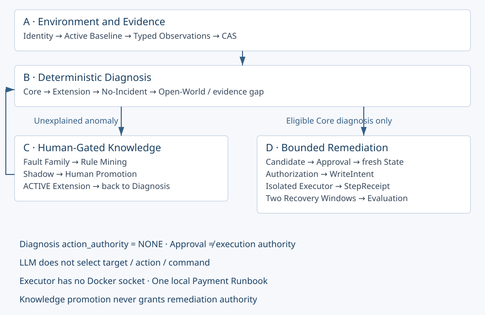

# EcomSRE-Agent

面向微服务故障定位与受限恢复的可验证 SRE Agent：由 Runtime 管理服务身份、证据缺口、诊断准入和动作权限；未知故障经人引导知识演化，真实恢复通过独立批准和状态绑定通道执行。

*A verifiable SRE Agent that turns typed telemetry into evidence-backed diagnoses, evolves environment-specific knowledge through human-gated evaluation, and executes only separately authorized bounded remediation.*

**当前状态：v0.4.1 收尾进行中 · 单租户本地 Product 原型 · Diagnosis 默认只读 · 一个真实 Payment 受限恢复闭环。**

[快速体验](docs/product/QUICKSTART.md) · [当前状态](docs/product/STATUS.md) · [架构](docs/product/ARCHITECTURE.md) · [受限恢复](docs/product/REMEDIATION.md) · [离线 HTML 手册](docs/interview/ecomsre-agent-v041-handbook.html)

## 已证明什么

| 版本 / 路径 | 实测结果 | 直接证据 |
| --- | --- | --- |
| v0.2.4 健康验收 | 30/30 checkout 事务；五类证据；`NO_INCIDENT`；能力限制 0 | [健康验收](docs/results/product-v024-nofault-acceptance-final.json) |
| v0.3 Kafka 知识演化 | P1/P2/P3 三个 Open-World 窗口形成一个故障族；Shadow recall 1.0 / FPR 0.0；H1 命中 `EXTENSION_KNOWN / kafka-queue-backlog / fraud-detection` | [故障族、规则与 H1](docs/analysis/product-v030-family-and-rule-summary.json) |
| v0.4 Payment 恢复 | `paymentFailure=100%` → `CORE_KNOWN` → 一个固定 Baseline 回滚 → 两个窗口各 39 请求 / 0 错误 → `RECOVERED`；gateway 消费 1 次，cleanup 后 0/0/0 | [真实恢复 JSON](docs/results/product-v040-minimal-payment/live-result.json) |
| v0.4.1 Live Safety Matrix | 正在验证 S0–S4；以结果包为准 | [安全矩阵](docs/results/product-v041-live-safety/README.md) |

这些是有界本地结果。Shadow 分母为 3 个正例与 10 个负向/反事实/失败用例，`OTHER_EXTENSION` 分层不可用。v0.4 Minimal 健康状态有 194 次直接 Payment 请求，但健康 Diagnosis 是 `INSUFFICIENT_EVIDENCE`，不能借用 v0.2.4 的 `NO_INCIDENT`。

## 为什么需要这个系统

告警不等于根因，进程健康也不等于业务健康。遥测缺失、采样噪声与服务别名会让“没查到”被误当作“没有问题”。Runtime 将来源、窗口、覆盖度与引用保留为类型化证据；确定性规则决定能否下结论，无法消解的缺口保留为不确定状态。

恢复还需要另一道边界：诊断正确不代表可以写入。Diagnosis 始终 `action_authority = NONE`。Product v0.4 增加默认关闭的独立通道，检查批准、目标身份、Baseline 和当前状态，再授予一次有时限的固定动作。

LLM 是可选的非权威命名/解释层，不选择目标、Runbook、命令或写参数。本页所列 Product 实测 Provider / LLM calls = 0。

## 四阶段演进

| 阶段 | 核心问题 | 已形成结果 |
| --- | --- | --- |
| 1 · 证据驱动诊断 | 证据缺失与工具选择 | Runtime 维护缺口、观测和诊断准入 |
| 2 · 可部署 Product | 研究代码缺少状态与接入 | FastAPI / Worker / SQLite / CAS / Baseline |
| 3 · 知识演化 | 环境特有未知故障 | Fault Family → Rule Mining → Shadow → H1 |
| 4 · 受限恢复 | 诊断如何连接真实动作 | Approval → state-bound Authorization → one write → two windows |

[Mermaid 源文件](docs/assets/ecomsre-v041-architecture.mmd) · [详细架构](docs/product/ARCHITECTURE.md)

## 一次真实 Incident

真实 Payment 失败 → 多源观测与配置变更证据 → `CORE_KNOWN / payment / CONFIGURATION_ERROR` → `ROLLBACK_CONFIGURATION` Candidate → 独立 Approval → fresh Current State → single-use AttemptAuthorization → WriteIntent → 独立 Executor → `APPLIED` StepReceipt → 两个外部恢复窗口 → `RECOVERED`。

`Approval ≠ execution authority`。执行器没有 Docker socket，只能调用固定恢复适配器。写入结果不确定时保留 `OUTCOME_UNKNOWN`；窗口验证失败时转人工，不因“已经回滚”就宣布恢复。

## 四个阅读与体验入口

1. [两分钟结果导览](docs/product/QUICKSTART.md#a-两分钟结果导览)：健康、知识演化、恢复和安全拒绝分别看证据。
2. [Docker-free 知识演化 Demo](docs/product/QUICKSTART.md#b-docker-free-知识演化-demo)：合成夹具，不是 Kafka live 复跑。
3. [Docker-free 受限恢复 Fixture Demo](docs/product/QUICKSTART.md#c-docker-free-受限恢复-fixture-demo)：检查权限与恢复状态机。
4. [已合并 Live Evidence Verifier](docs/product/QUICKSTART.md#d-已合并-live-evidence-verifier)：验证已有证据，不重新运行 Docker。

## 代码与证据路线

[Product](src/ecomsre/product) → [Diagnosis bridge](src/ecomsre/product/incidents/diagnosis_bridge.py) → [Knowledge runtime](src/ecomsre/product/knowledge/runtime.py) → [Remediation](src/ecomsre/product/remediation) → [安全 harness](scripts/product/live_safety_v041) → [claim map](docs/analysis/product-v041-claim-map.json)。

[面试讲稿](docs/interview/PROJECT_PITCH.md) · [失败历史](docs/history/PROJECT_EVOLUTION.md) · [API](docs/product/API.md) · [运维](docs/product/OPERATIONS.md)

## 能力边界

只有一个本地 Payment 配置故障和一个 Runbook 被真实验证；知识演化仍是小样本 deterministic baseline。没有生产自主自愈、跨环境泛化、通用 exactly-once、多租户、HA、Kubernetes 或长期 SLO 证明。完整 28 服务 Harness 的失败记录保留，不能被 Minimal 成功替代。

[完整限制](docs/product/LIMITATIONS.md)列出已证明与未证明的边界。上游 OTel Demo 提供被观测微服务；本项目提供证据、诊断、知识治理及受限恢复链路。个人贡献需按实际职责说明。
