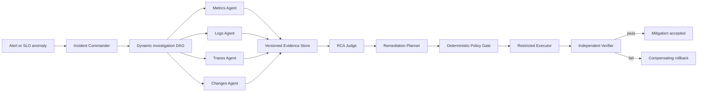

# EcomSRE-Agent Architecture

## Status and purpose

This document describes durable cross-phase system boundaries. Phase 0
canonical acceptance remains incomplete, while later replay, evaluation, and
the separately bounded LOCAL_DEMO successor have their own accepted decisions
and evidence. A green later-phase result does not rewrite Phase 0.

Decision references: `DEC-002`, `DEC-003`, `DEC-007`, `DEC-008`, `DEC-010`,
`DEC-011`, `DEC-031`, and `DEC-032` govern the historical paths described below.
`DEC-033` through `DEC-038` govern the separately versioned Diagnosis-to-Action
v2 contracts, admission, authorization, bounded read-only runtime, PR-D
development Agent identity, PR-E replay evaluation, and the PR-F known-scenario
local live Demo.
`DEC-039` through `DEC-043` govern the independent DTA v2.1 P0 successor,
crossed service and mechanism matrix, evidence-guided planner, compact
deterministic context, frozen three-arm evaluation, and exact bounded local
portfolio.

## Logical planes

| Plane | Responsibility | Authority |
|---|---|---|
| Environment | Frozen e-commerce services and observability backends | No agent authority |
| Scenario control | Inject, reset, and record controlled faults | Evaluator-only truth |
| Observation | Metrics, logs, traces, service state, and sanitized changes | Read-only |
| Diagnosis | Single-Agent or dynamic Multi-Agent investigation | Read-only |
| Remediation | Plan typed, bounded actions | No direct execution |
| Execution | Enforce policy and execute an allowlisted mutation | Restricted write |
| Verification | Check infrastructure and business SLO independently | Read-only plus rollback request |
| Evaluation | Score all experimental arms against hidden truth | External to the tested systems |

The authority boundary is normative; see
[SAFETY_BOUNDARIES.md](SAFETY_BOUNDARIES.md).

## End-to-end flow

The diagram above is the historical Dynamic Multi-Agent path, not a claim that
every repository workflow uses it. Phase 1 contains a read-only Single-Agent
tool loop; Phase 2 contains Fixed and Dynamic Multi-Agent replay; Phase 3
contains replay-only restricted remediation; and the LOCAL_DEMO successor used
one Strong Single diagnosis plus one exact allowlisted local configuration
restoration. Its strict R3 diagnosis remained negative because of a fault-class
mismatch. Exact evidence and claim limits live in the result documents.

Diagnosis-to-Action v2 does not replace those paths. It adds the namespaced
offline contracts described in
[diagnosis-to-action-v2.md](design/diagnosis-to-action-v2.md). PR-B adds
deterministic admission, exact authorization records, and fake-only
Executor/Verifier transactions. PR-C adds five strict read adapters and a
separate full-run Evidence Store: fixed-query loopback Prometheus, OpenSearch,
and Jaeger adapters plus GET-only, exact-owned local Unix Docker runtime and
resource inspection. Production reads require an owned-lifecycle authority
capability issued only after fresh local-daemon re-authentication and bound to
the frozen configuration, a fresh resolve equal to the admitted Sandbox, exact
endpoints, and ownership labels. The full revalidated authority context and
canonical request resolver envelopes persist in the run-scoped store separately
from the diagnosis-cited view.
The observation plane never exposes raw container, trace, or span identities.
PR-D adds a bounded two-stage Agent: investigation may dispatch at most four
read tools and must end in a typed Diagnosis; a separate semantic call sees only
the safe candidate projection and produces a non-authorizing selection that the
trusted runtime binds into an ActionProposal. The provisionally frozen identity
is `config/dta-v2/agent-identity.v1.json`.

Fresh replay-only Provider development Smoke
`4d07fee0c13e440db6d78c9bd3180286` passed with the preferred model, four
Provider turns, two successful read dispatches, a Payment configuration
Diagnosis, and a candidate-bound `ROLLBACK_CONFIGURATION` proposal. Three
failed attempts remain retained. All four attempts recorded zero Docker, fault,
Runbook, Executor, Verifier, forward/configuration/service, and public writes.
This establishes the PR-D development Provider gate only: no real Executor,
Docker mutation, held-out result, live remediation, or live acceptance.

PR-E uses a separate evaluation-case manifest rather than extending the three
operational `ScenarioRegistry` entries. Its public dataset contains six
development and three no-action/ambiguous cases; three held-out case/truth
hashes bind private replay bytes. Development passed all 18 two-arm entries.
The one-time held-out execution completed with truth isolation, scorer
verification, and zero unsafe proposals, but Adaptive Tool-Using underperformed
One-shot Full Context on mechanism, Runbook, evidence, and action metrics.
`DEC-037` therefore records a negative Tool-Use-superiority result and forbids
result-driven tuning or rerun. This is replay diagnosis/action-selection
evidence only, not live recovery evidence or execution authority.

PR-F uses a separate one-shot owned campaign capability over the exact local
Unix Docker daemon, frozen Compose/image authority, four-slot schedule, current
Agent identity, Registry, admission/authorization code, fixed typed controls,
Executors, Verifiers, and reporting surface. Evaluator labels do not enter the
operational path; current state is bound to the trusted Diagnosis and Proposal.
The Agent has read tools and typed proposal output only. Before every fault and
forward write, the deterministic runtime refreshes daemon, ownership, state,
time, and authorization bindings. Before cleanup it separately refreshes the
daemon/context, upstream, Compose, and ownership authority. Every attempted
forward step produces a receipt before continuation.

The accepted campaign completed one no-fault zero-write case plus Payment
configuration rollback, Recommendation owned-service restart, and Email
two-step leak mitigation. Each positive case passed two canonical recovery
windows, restored its exact baseline, and finished `CLEAN`; aggregate unsafe
write and arbitrary-shell counters were zero and no non-owned resource changed.
This is known-scenario local Portfolio engineering evidence under `DEC-038`,
not production, held-out recovery accuracy, or arbitrary autonomous authority.
Because PR-F changed the investigation Prompt, the PR-E held-out negative
remains applicable only to its historical frozen Agent identity and was not
rerun.

Diagnosis-to-Action v2.1 is a second independent namespace described in
[diagnosis-to-action-v2.1-p0.md](design/diagnosis-to-action-v2.1-p0.md). It
preserves the entire v2 portfolio by exact historical bindings, then crosses
services and mechanisms so service identity cannot stand in for diagnosis.
Its Strong Single Agent explicitly tracks hypotheses and evidence gaps, while
the runtime projects a reproducible bounded Evidence Index instead of resending
the complete accumulated transcript. Investigation and candidate-bound Action
Selection remain separate. The model has zero executable authority; trusted
runtime code owns candidate construction, admission, authorization, fixed
execution, and verification. PR-A freezes only this protocol and namespace;
later runtime, evaluation, and live claims require their own exact stage gates.

Fresh authorized no-fault PR-C Smoke
`f8532f3a6ab5242ab5bba2f8ae1a6caf` closed the PR-C read-only gate
`PASS / CLEAN` with all five tools successful and all prohibited-action
counters zero; this does not establish live remediation or Live acceptance.

## Phase 0 environment boundary

The environment uses the read-only upstream submodule specified by `DEC-002`.
The preferred topology is the upstream `compose.yaml` plus
`compose.observability.yaml`. `compose.full.yaml`, agentic, profiling, extras,
Kubernetes, and private topology rewrites are excluded by `DEC-003`.

Project-owned wrappers may provide:

- resource namespacing and ownership labels;
- frozen environment overrides and image digest selection;
- lifecycle and evidence orchestration;
- programmatic probes and query fixtures.

They must not modify upstream source or change upstream behavior to conceal an
unsupported environment.

## Stable interface between Phase 0 and later phases

Phase 0 must produce a versioned run bundle rather than expose backend-specific
responses as the project API. The stable envelope contains:

- opaque run and scenario-instance references;
- source, service, time window, and scenario phase;
- observation versus inference type;
- query or probe identity and version;
- raw artifact reference and content hash;
- completeness, limitations, and freshness metadata.

Raw Prometheus, Jaeger, and OpenSearch responses remain immutable attachments.
Phase 1 tools normalize them into the Evidence Contract. Query fixtures are
frozen to OTel Demo 3.0.0 `demo.*` telemetry.

## Trust zones

Observer-visible artifacts and evaluator-only artifacts are separate roots.
The observer zone may contain sanitized change records, telemetry, probes, and
environment manifests. It must not contain feature-flag keys or values,
scenario names, expected answers, or semantic paths that reveal ground truth.

The evaluator zone maps opaque references to exact injections and structured
answers. The external evaluator scores every architecture, including the
internal RCA Judge output.

## Dynamic Multi-Agent criteria

Phase 2 is dynamic only if the Commander can create, revise, stop, and
checkpoint investigation tasks based on evidence and budgets. Specialist
agents receive scoped tool contexts, not a shared dump of raw telemetry.
Hypotheses are adjudicated using supporting, contradicting, and missing
evidence; voting alone is insufficient.

Multi-agent value is an empirical result, not an architectural assumption.
`DEC-010` and `DEC-011` govern the comparison.

## Persistence

- SQLite stores events, state transitions, checkpoints, and compact structured
  state.
- JSON/JSONL stores large evidence and immutable run artifacts.
- Artifacts carry schema versions and hashes.
- Replay consumes captured tool responses and state transitions without
  exposing evaluator-only truth.

The original Phase 1 schemas and the independent `dta-v2.*` schemas are
versioned separately. Remaining observation-owned decisions are tracked in
[OPEN_QUESTIONS.md](OPEN_QUESTIONS.md).
