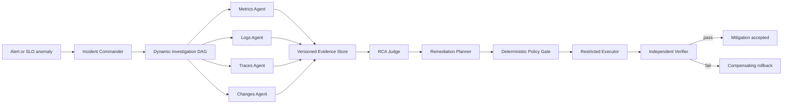

# EcomSRE-Agent Architecture

## Status and purpose

This document describes accepted system boundaries. Only the Phase 0 contract
is currently actionable; later components remain deferred.

Decision references: `DEC-002`, `DEC-003`, `DEC-007`, `DEC-008`, `DEC-010`,
and `DEC-011`.

## Logical planes

| Plane | Responsibility | Authority |
|---|---|---|
| Environment | Frozen e-commerce services and observability backends | No agent authority |
| Scenario control | Inject, reset, and record controlled faults | Evaluator-only truth |
| Observation | Metrics, logs, traces, service state, and sanitized changes | Read-only |
| Diagnosis | Single-Agent or dynamic Multi-Agent investigation | Read-only |
| Remediation | Plan typed, bounded actions | No direct execution |
| Execution | Enforce policy and execute an allowlisted mutation | Restricted write |
| Verification | Check infrastructure and business SLO independently | Read-only plus rollback request |
| Evaluation | Score all experimental arms against hidden truth | External to the tested systems |

The authority boundary is normative; see
[SAFETY_BOUNDARIES.md](SAFETY_BOUNDARIES.md).

## End-to-end flow

In Phase 0, only the Environment, Scenario control, Observation readiness, and
deterministic evaluation portions exist conceptually. No agent or remediation
component is implemented. The complete exclusion list is owned by
[PROJECT_CHARTER.md](PROJECT_CHARTER.md).

## Phase 0 environment boundary

The environment uses the read-only upstream submodule specified by `DEC-002`.
The preferred topology is the upstream `compose.yaml` plus
`compose.observability.yaml`. `compose.full.yaml`, agentic, profiling, extras,
Kubernetes, and private topology rewrites are excluded by `DEC-003`.

Project-owned wrappers may provide:

- resource namespacing and ownership labels;
- frozen environment overrides and image digest selection;
- lifecycle and evidence orchestration;
- programmatic probes and query fixtures.

They must not modify upstream source or change upstream behavior to conceal an
unsupported environment.

## Stable interface between Phase 0 and later phases

Phase 0 must produce a versioned run bundle rather than expose backend-specific
responses as the project API. The stable envelope contains:

- opaque run and scenario-instance references;
- source, service, time window, and scenario phase;
- observation versus inference type;
- query or probe identity and version;
- raw artifact reference and content hash;
- completeness, limitations, and freshness metadata.

Raw Prometheus, Jaeger, and OpenSearch responses remain immutable attachments.
Phase 1 tools normalize them into the Evidence Contract. Query fixtures are
frozen to OTel Demo 3.0.0 `demo.*` telemetry.

## Trust zones

Observer-visible artifacts and evaluator-only artifacts are separate roots.
The observer zone may contain sanitized change records, telemetry, probes, and
environment manifests. It must not contain feature-flag keys or values,
scenario names, expected answers, or semantic paths that reveal ground truth.

The evaluator zone maps opaque references to exact injections and structured
answers. The external evaluator scores every architecture, including the
internal RCA Judge output.

## Dynamic Multi-Agent criteria

Phase 2 is dynamic only if the Commander can create, revise, stop, and
checkpoint investigation tasks based on evidence and budgets. Specialist
agents receive scoped tool contexts, not a shared dump of raw telemetry.
Hypotheses are adjudicated using supporting, contradicting, and missing
evidence; voting alone is insufficient.

Multi-agent value is an empirical result, not an architectural assumption.
`DEC-010` and `DEC-011` govern the comparison.

## Persistence

- SQLite stores events, state transitions, checkpoints, and compact structured
  state.
- JSON/JSONL stores large evidence and immutable run artifacts.
- Artifacts carry schema versions and hashes.
- Replay consumes captured tool responses and state transitions without
  exposing evaluator-only truth.

Exact schemas remain deferred to Phase 1 and are tracked in
[OPEN_QUESTIONS.md](OPEN_QUESTIONS.md).
