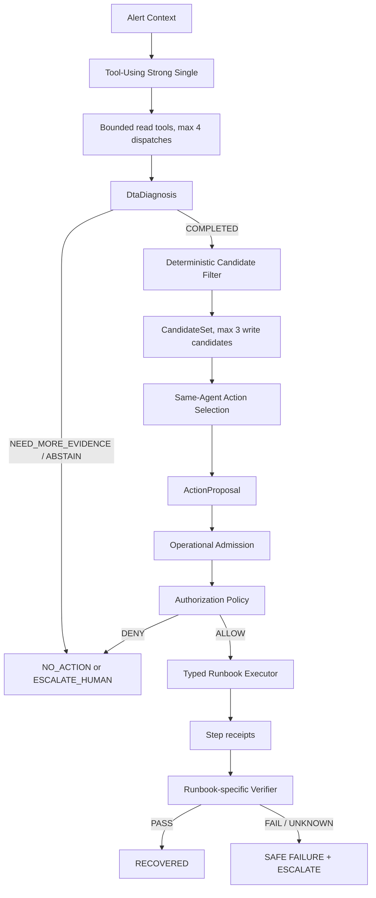

# Diagnosis-to-Action v2 Frozen Design

Status: `PR_B_OFFLINE_FAKE_RUNTIME_IMPLEMENTED / LIVE_NOT_EXECUTED`

Decision owners: `DEC-033`, `DEC-034`, `DEC-035`
Safety owner: [SAFETY_BOUNDARIES.md](../SAFETY_BOUNDARIES.md)

## Claim boundary

The existing LOCAL_DEMO proved one known Payment root, one allowlisted local
configuration restoration, two recovery windows, and clean cleanup. The strict
R3 diagnosis remained negative because its fault class was wrong. The current
repository also already contains bounded read-only tool use and historical
Multi-Agent workflows. Diagnosis-to-Action v2 therefore claims neither that
Tool Use is new nor that prior diagnosis was fully correct.

The new work is a namespaced successor that connects adaptive read-only
investigation to deterministic multi-Runbook selection. Contract/registry work
does not prove an Agent, Executor, held-out result, or live recovery.

## Frozen decisions

| ID | Decision |
|---|---|
| DTA-001 | Portfolio Demo first; replay held-out evidence is reported separately. |
| DTA-002 | MVP scenarios are Payment configuration failure, Recommendation stopped, and Email memory leak. |
| DTA-003 | Email is one Proposal containing at most two fixed typed forward steps. |
| DTA-004 | One Tool-Using Strong Single identity remains the default. |
| DTA-005 | Diagnosis and Action Selection use two separate semantic stages. |
| DTA-006 | Maximum read-tool dispatches per investigation is four. |
| DTA-007 | Normalized identical read-tool calls may not repeat. |
| DTA-008 | `list_recent_changes` is deferred from the MVP. |
| DTA-009 | `RECREATE_SERVICE` is deferred from the MVP. |
| DTA-010 | Conditional Reviewer is deferred from the MVP. |
| DTA-011 | Operational Admission never reads evaluator truth. |
| DTA-012 | Final live results are known-scenario engineering Demo evidence, not held-out accuracy. |
| DTA-013 | Compare One-shot Full Context and Tool-Using Strong Single; Tool Use superiority is not assumed. |
| DTA-014 | No-action and escalation are first-class results. |
| DTA-015 | Actual writes remain deterministic, typed, allowlisted, and verified. |

Authorization is owned separately by `DEC-035`: this Master Goal is the
standing human record for the exact LOW and MEDIUM scopes, and every concrete
attempt requires an expiring run-bound child.

## Architecture

The Agent owns no write authority. Runtime-owned fields include risk,
preconditions, executor, verifier, ownership, authorization, and step limits.
`NEED_MORE_EVIDENCE` is a diagnosis terminal, not a write action.

## Namespace and contracts

Product namespace: `ecomsre.dta_v2`
Schema namespace: `dta-v2.*`

This avoids collision with the existing Phase 5A `DiagnosisResultV2`.

| Contract | Required boundary |
|---|---|
| `ScenarioSpec` | Opaque agent-visible alert template; no evaluator labels. |
| `DtaDiagnosis` | Run-bound root/domain/mechanism, canonical references, and exact `service:{root}` entity binding. |
| `ResolvedDiagnosisEvidenceView` | Run-bound, diagnosis-scoped exact view containing only the Diagnosis supporting plus contradicting references, their sources, artifact hashes, and a semantic digest. |
| `RunbookSpec` | Fully hash-frozen domain/mechanism/target applicability, risk, parameter schema, preconditions, ordered fixed steps, executor/verifier IDs, and step cap. |
| `CandidateSet` | Diagnosis/resolved-evidence-bound deterministic target-specific write candidates plus fail-closed dispositions; `resolved_evidence_sha256` binds the diagnosis-scoped resolved view. |
| `ActionProposal` | Accepted only after binding to the actual CandidateSet, Diagnosis, ResolvedDiagnosisEvidenceView, and trusted RunbookSpec and covering every required evidence source; no risk, commands, paths, URLs, or container IDs. |
| `OperationalAdmission` | Deterministic current-state, ownership, evidence, parameter, authorization, and precondition verdict. |
| `AuthorizationRecord` | Standing exact Master scope plus an expiring run/attempt-bound child; neither is model-writable. |
| `StepReceipt` | Before/after state digest, time window, outcome, error, and semantic hash for each attempted fixed step. |
| `ExecutionTransaction` | Registry-ordered bounded receipts, Verification identity, terminal, and safe escalation binding. |
| `VerificationResult` | Fake-backend PR-B infrastructure and business-SLI verdict base contract; real adapters remain later-stage work. |

The current offline slice implements the structural contracts through
`ActionProposal`, explicit Registry and selected-Runbook digest binding,
deterministic Operational Admission, Master and attempt Authorization records,
fixed-step fake Executors, per-step receipts, and fake Verifiers. It does not
claim that an artifact exists in a real Evidence Store; the trusted
resolver/adapter producer is PR-C. No Docker, Provider, fault injection, or real
mutation was executed by PR-B.

`ResolvedDiagnosisEvidenceView` is permanently diagnosis-scoped: its reference
set must equal the Diagnosis supporting plus contradicting reference set. A
future full-run `EvidenceStoreSnapshot` is a separate PR-C contract and may
contain additional run evidence; it must not broaden or silently replace this
exact view. Likewise, the PR-B Operational Admission current-state snapshot
uses its own independently named digest field. It does not reuse
`resolved_evidence_sha256` with different semantics.

`confidence` remains a non-authorizing diagnosis observation. Candidate
filtering and Operational Admission must not use model-reported confidence to expand
the Runbook, target, risk, evidence, or authorization boundary.

## Tool budget

The MVP read tools are `query_metrics`, `search_logs`,
`query_trace_neighborhood`, `inspect_service_runtime`, and
`inspect_resource_usage`. At most four are dispatched in one investigation and
an identical normalized request cannot repeat. Existing legacy `list_changes`
is preserved but disabled from the first live tool set pending `OQ-011`.

Investigation can require an initial Provider turn, up to four tool
continuations, and a diagnosis terminal. Action Selection is one later turn.
Provider turns, tool dispatches, and semantic terminals must be reported as
separate counters.

## Scenario and Runbook matrix

| Scenario | Diagnosis | Runbook | Risk | Forward steps | Verification target |
|---|---|---|---|---:|---|
| Payment configuration failure | `CONFIGURATION / CONFIGURATION_ERROR / payment` | `ROLLBACK_CONFIGURATION` | LOW | `RESTORE_BASELINE_CONFIGURATION` | Frozen config agreement, Payment errors, SLI, two windows |
| Recommendation stopped | `SERVICE_RUNTIME / SERVICE_UNAVAILABLE / recommendation` | `RESTART_SERVICE` | LOW | `RESTART_OWNED_SERVICE(wait_for_health_seconds: 5..120)` | Owned service running/healthy, endpoint, upstream SLI, two windows |
| Email memory leak | `LOCAL_RESOURCE / MEMORY_LEAK / email` | `MITIGATE_MEMORY_LEAK` | MEDIUM | `DISABLE_LEAK_FLAG` → `RESTART_OWNED_SERVICE(wait_for_health_seconds: 5..120)` | Flag off, restart receipt, memory slope, health, SLI, two windows |

No real fault, conflicting evidence, or no compatible Runbook must end with
zero write actions through `NO_ACTION`, `NEED_MORE_EVIDENCE`, or
`ESCALATE_HUMAN`.

The Email two-step Runbook freezes a fail-closed partial failure policy. If
`DISABLE_LEAK_FLAG` succeeds and `RESTART_OWNED_SERVICE` fails, execution must
preserve the safer completed flag-disable step, must not reopen the leak flag,
must not issue another forward write, and must terminate
`PARTIALLY_APPLIED / ESCALATE_HUMAN`. PR-B must persist one `StepReceipt` per
attempted step; it may not infer transaction success from only the aggregate
terminal.

## PR plan

1. PR-0: decisions, architecture, safety, claim corrections, and this design.
2. PR-A: contracts, observer scenario registry, Runbook registry, and Candidate Filter.
3. PR-B: deterministic Admission, Policy, transaction, per-step receipts, and fake-backend Executor/Verifier tests.
4. PR-C: five typed read-tool adapters; no write behavior.
5. PR-D: bounded Tool-Using Strong Single and candidate-bound Action Selection.
6. PR-E: six development, three replay held-out, and at least three no-action/ambiguous cases.
7. PR-F: separately authorized local Live integration and evidence.

Implementation, tests, or merge readiness never authorizes the protected Live
actions in PR-F.

## Test plan

The offline gates must cover strict schemas, full Registry digest locks, truth
isolation, exact diagnosis-scoped resolved evidence/run binding, canonical
semantic digests, domain/root/target compatibility, complete Runbook-required
proposal evidence-source coverage, real CandidateSet proposal binding,
parameter/authority rejection, no-action paths, and historical regression.
Later phases add policy/ownership, transaction interruption, Executor,
Verifier, Agent-budget, replay evaluation, and Live lifecycle tests.

One-shot Full Context and Adaptive Tool-Using use the same model lock, ontology,
output contracts, Candidate Filter, and scorer. Held-out reports diagnosis,
mechanism, Runbook Top-1, evidence validity, action precision, escalation,
unsafe writes, Provider turns, tokens, and latency. Live recovery is reported
separately and cannot be labeled held-out accuracy.

## Live acceptance boundary

A later Live Goal must bind exact branch/HEAD, local Unix Docker, Compose/image
locks, ownership labels, baseline, scenario, Runbook, parameters, authorization,
Provider boundary, and cleanup. Each of the three known scenarios must pass one
fault impact, compatible diagnosis and proposal, exact Policy admission,
Runbook-specific execution, two recovery windows, baseline restoration, and
clean project-owned cleanup. A no-fault case must produce zero writes.

Only all three scenario passes, the no-fault pass, zero unsafe write attempts,
zero historical-result changes, and clean cleanup can support
`DTA_V2_LIVE_DEMO_ACCEPTANCE_PASS`. Any failed scenario remains preserved with
its exact terminal and keeps the overall state `REVIEW_REQUIRED`.
