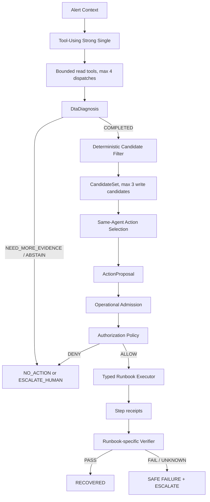

# Diagnosis-to-Action v2 Frozen Design

Status: `PR_E_EVALUATION_COMPLETE / HELD_OUT_NEGATIVE / ZERO_UNSAFE_PROPOSALS`

Decision owners: `DEC-033`, `DEC-034`, `DEC-035`, `DEC-036`, `DEC-037`
Safety owner: [SAFETY_BOUNDARIES.md](../SAFETY_BOUNDARIES.md)

## Claim boundary

The existing LOCAL_DEMO proved one known Payment root, one allowlisted local
configuration restoration, two recovery windows, and clean cleanup. The strict
R3 diagnosis remained negative because its fault class was wrong. The current
repository also already contains bounded read-only tool use and historical
Multi-Agent workflows. Diagnosis-to-Action v2 therefore claims neither that
Tool Use is new nor that prior diagnosis was fully correct.

The new work is a namespaced successor that connects adaptive read-only
investigation to deterministic multi-Runbook selection. Contract/registry work
does not prove an Agent, Executor, held-out result, or live recovery.

## Frozen decisions

| ID | Decision |
|---|---|
| DTA-001 | Portfolio Demo first; replay held-out evidence is reported separately. |
| DTA-002 | MVP scenarios are Payment configuration failure, Recommendation stopped, and Email memory leak. |
| DTA-003 | Email is one Proposal containing at most two fixed typed forward steps. |
| DTA-004 | One Tool-Using Strong Single identity remains the default. |
| DTA-005 | Diagnosis and Action Selection use two separate semantic stages. |
| DTA-006 | Maximum read-tool dispatches per investigation is four. |
| DTA-007 | Normalized identical read-tool calls may not repeat. |
| DTA-008 | `list_recent_changes` is deferred from the MVP. |
| DTA-009 | `RECREATE_SERVICE` is deferred from the MVP. |
| DTA-010 | Conditional Reviewer is deferred from the MVP. |
| DTA-011 | Operational Admission never reads evaluator truth. |
| DTA-012 | Final live results are known-scenario engineering Demo evidence, not held-out accuracy. |
| DTA-013 | Compare One-shot Full Context and Tool-Using Strong Single; Tool Use superiority is not assumed. |
| DTA-014 | No-action and escalation are first-class results. |
| DTA-015 | Actual writes remain deterministic, typed, allowlisted, and verified. |

Authorization is owned separately by `DEC-035`: this Master Goal is the
standing human record for the exact LOW and MEDIUM scopes, and every concrete
attempt requires an expiring run-bound child.

## Architecture



The Agent owns no write authority. Runtime-owned fields include risk,
preconditions, executor, verifier, ownership, authorization, and step limits.
`NEED_MORE_EVIDENCE` is a diagnosis terminal, not a write action.

## Namespace and contracts

Product namespace: `ecomsre.dta_v2`
Schema namespace: `dta-v2.*`

This avoids collision with the existing Phase 5A `DiagnosisResultV2`.

| Contract | Required boundary |
|---|---|
| `ScenarioSpec` | Opaque agent-visible alert template; no evaluator labels. |
| `DtaDiagnosis` | Run-bound root/domain/mechanism, canonical references, and exact `service:{root}` entity binding. |
| `ResolvedDiagnosisEvidenceView` | Run-bound, diagnosis-scoped exact view containing only the Diagnosis supporting plus contradicting references, their sources, artifact hashes, and a semantic digest. |
| `RunbookSpec` | Fully hash-frozen domain/mechanism/target applicability, risk, parameter schema, preconditions, ordered fixed steps, executor/verifier IDs, and step cap. |
| `CandidateSet` | Diagnosis/resolved-evidence-bound deterministic target-specific write candidates plus fail-closed dispositions; `resolved_evidence_sha256` binds the diagnosis-scoped resolved view. |
| `ActionProposal` | Accepted only after binding to the actual CandidateSet, Diagnosis, ResolvedDiagnosisEvidenceView, and trusted RunbookSpec and covering every required evidence source; no risk, commands, paths, URLs, or container IDs. |
| `EvidenceStoreSnapshot` | Full run-scoped, canonical, digest-bound record of every dispatched success or typed failure; it is separate from the diagnosis-cited resolved view. |
| `OperationalAdmission` | Deterministic current-state, ownership, evidence, parameter, authorization, and precondition verdict. |
| `AuthorizationRecord` | Standing exact Master scope plus an expiring run/attempt-bound child; neither is model-writable. |
| `StepReceipt` | Before/after state digest, time window, outcome, error, and semantic hash for each attempted fixed step. |
| `ExecutionTransaction` | Registry-ordered bounded receipts, Verification identity, terminal, and safe escalation binding. |
| `VerificationResult` | Fake-backend PR-B infrastructure and business-SLI verdict base contract; real adapters remain later-stage work. |

The current implementation provides the structural contracts through
`ActionProposal`, explicit Registry and selected-Runbook digest binding,
deterministic Operational Admission, Master and attempt Authorization records,
fixed-step fake Executors, per-step receipts, fake Verifiers, five typed
read-only adapters, a full run-scoped Evidence Store, and the bounded PR-D
Tool-Using Strong Single plus candidate-bound Action Selection. Prometheus,
OpenSearch, and Jaeger use fixed loopback-only queries; runtime and resource
inspection use GET-only Docker Engine HTTP over a local Unix socket with exact
ownership labels. Fake/replay backends remain available for deterministic
tests. No Provider, fault injection, Runbook execution, or service mutation is
part of the PR-C read-tool runtime. PR-D separately permits real Provider
development calls over fake/replay reads only; PR-E adds a separate
evaluation-case manifest, owned evidence capture, two-arm replay evaluation,
and a one-time held-out seal. Neither phase creates execution or write
authority.

Fresh authorized no-fault read-only Smoke `f8532f3a6ab5242ab5bba2f8ae1a6caf`
completed terminal `PASS`, read-tool terminal `PASS`, unchanged baseline, and
`CLEAN` cleanup. All five tools returned `SUCCESS` in exactly one dispatch
each. Owned containers, networks, and volumes ended at `0/0/0`; no non-owned
resources changed; and the fault-injection, Agent, Provider, Runbook,
forward/configuration/service-mutation counters all remained zero. Its report
semantic SHA-256 is
`6b7c69192c06e9bdef23ccd0c75bf7a822acdd2cc37da82e0d9a6fd450147b1b` and its
closure semantic SHA-256 is
`832ef7f326955100364e6d38678bb44345be99c994e44fa364471764072d20cc`.
The first retained attempt remains `FAIL`, with primary `READ_TOOL_FAILED` and
terminal `CLEANUP_BLOCKED`; it also ended with zero owned resources and zero
prohibited-action counters. The fresh result closes only the PR-C read-only
gate `PASS / CLEAN`; it is not live remediation or Live acceptance.

`ResolvedDiagnosisEvidenceView` is permanently diagnosis-scoped: its reference
set must equal the Diagnosis supporting plus contradicting reference set. The
full-run `EvidenceStoreSnapshot` is a separate contract and may contain
additional run evidence; its resolver selects only successful refs actually
cited by the Diagnosis and cannot broaden or silently replace this exact view.
Likewise, the PR-B Operational Admission current-state snapshot
uses its own independently named digest field. It does not reuse
`resolved_evidence_sha256` with different semantics.

`confidence` remains a non-authorizing diagnosis observation. Candidate
filtering and Operational Admission must not use model-reported confidence to expand
the Runbook, target, risk, evidence, or authorization boundary.

## Tool budget

The MVP read tools are `query_metrics`, `search_logs`,
`query_trace_neighborhood`, `inspect_service_runtime`, and
`inspect_resource_usage`. At most four are dispatched in one investigation and
an identical normalized request cannot repeat. `list_recent_changes` remains
unavailable in the MVP; the historical namespaced `list_changes` path is not
part of the DTA v2 tool surface.

Every request is normalized and hash-bound before dispatch. Every dispatch,
including a backend failure or rejected duplicate, consumes the investigation
budget and produces a typed, run-bound, artifact-hashed observation. A fifth
dispatch is rejected without a backend call. Tool projections are bounded and
exclude raw URLs, queries, container IDs, trace/span IDs, scenario control, and
evaluator truth. The no-fault Smoke harness runs all five adapter gates as five
independent one-dispatch investigations so no investigation exceeds the
four-dispatch Agent budget. The fresh real local Smoke reported above passed
that read-only exit gate; it does not establish Agent behavior, remediation, or
Live acceptance.

The owned lifecycle entry point is:

```bash
PYTHONPATH=src uv run --frozen --no-sync python -m ecomsre.dta_v2.read_only_smoke \
  owned-lifecycle \
  --repository-root "$(pwd)" \
  --private-root "<new-private-create-once-root>" \
  --smoke-id "<32-lower-hex>" \
  --service payment
```

It delegates start, image/Compose admission, dual-label ownership checks, and
cleanup to the existing `SandboxEnvironment`. The production backend is
created only from an opaque capability issued by this owned lifecycle after
readiness and stabilization: the issuer freshly re-authenticates the local
daemon, freshly resolves the Sandbox, rejects drift from the admitted resolve,
and binds the daemon context, frozen ConfigBundle, proven resolved Sandbox,
exact loopback and Unix-socket endpoints, and exact project/Sandbox labels.
The complete safe authority context is revalidated and persisted in every
observation and Evidence Store snapshot. Injected test transports use only
`FAKE_REPLAY` authority. Redirects and proxies are disabled for telemetry
reads; Docker inspection is GET-only over the admitted Unix socket. The
lifecycle verifies the frozen baseline before and after the five reads and
persists one create-once typed closure containing its ordered attempt journal,
including failures during admission, partial start, readiness, baseline checks,
reads/evidence persistence, and cleanup. It records exact zero counters for
fault injection, Agent and Provider calls, Runbook execution,
forward/configuration/service mutation. `PASS` additionally requires owned
resources `0 / 0 / 0`, unchanged non-owned Docker resources, and `CLEAN`
cleanup.

Investigation can require an initial Provider turn, up to four tool
continuations, and a diagnosis terminal. Action Selection is one later turn.
Provider turns, tool dispatches, and semantic terminals must be reported as
separate counters.

## Agent identity and PR-D Provider development gate

PR-D froze a provisional identity for its compatibility gate. Before PR-E
held-out sealing, development evidence selected the Goal-permitted compatible
configured model `gpt-5.4-2026-03-05`. The current frozen identity in
`config/dta-v2/agent-identity.v1.json` uses temperature `0`, prompt SHA-256
`42c21be36772f9ae7a6d0dcf6d910e6cdb58b5e5a08a9807487b4ee54f84bcce`,
tool-schema SHA-256
`6b968f29201ce7c87fe56099788ff34abc93dea895c56e553e4c007b22218192`, and
identity SHA-256
`aa08b5869aaac7e4ad4b1084367fc99a01c6dd05521ea933fddf9b5fb364ca61`.
The identity also binds the Diagnosis, Action Selection, ActionProposal schema,
and Provider-adapter hashes. Runtime tests recompute the complete identity and
reject drift.

Development Smoke `4d07fee0c13e440db6d78c9bd3180286` completed `PASS` after
four Provider turns and two successful replay-only read dispatches. It produced
`payment / CONFIGURATION / CONFIGURATION_ERROR` and a candidate-bound
`ROLLBACK_CONFIGURATION` proposal. Report SHA-256 is
`8cd1d905ded1b5a1d13f707465036573da79f8f0a6c0950a50450077098ca305`;
Agent-result SHA-256 is
`c9744aec45e6e6fcec441e7bcbd3f24779ada5b48fab0fc1906ae99a02daa82b`;
private evidence-manifest semantic SHA-256 is
`f774045d9b9bdbf6515de139f787c1b237c983e7d9baa97eddcfdddd80ac5779`.
The three prior attempts remain `FAIL / PROVIDER_PROTOCOL_FAILURE` with report
SHA-256 values `36a52b2995b9f0ec91b7c6bf6beae2ac18db188f86bdb9718d0165dd05ddddd2`,
`ac5d916f439720fb047a51a2a52fee8d178221e81729382ec3cc66f8decb80b4`,
and `7b34d8318b3e0d61f46aaa16f891ea6a517a39ae614df1ce652b298f0814e617`.
Every attempt recorded all prohibited-action counters at zero. The result is a
development compatibility gate, not held-out evidence, a real Runbook
execution, live remediation, or Live acceptance.

## PR-E capture, development, and held-out result

The public evaluation manifest SHA-256 is
`9ae255ea385a8bfc486032bdb26c6bf76b8bcc9cfa2a06417282cb2287542d92`.
It exposes six development plus three no-action/ambiguous case/truth bindings;
the three replay-held-out cases remain private and are represented publicly
only by case and truth hashes. Evaluation cases are not operational
`ScenarioRegistry` entries and do not broaden Master Authorization.

Owned capture `00af08e75935b1c9eb52081311592818` completed `PASS`, selected
the bounded measurable `1000x` Email variant, restored the exact baseline, and
finished `CLEAN` with owned resources `0/0/0`, no non-owned drift, and all
Agent/Provider/Runbook/Executor/Verifier/remediation counters zero. Closure
SHA-256 is
`62263e5bcfc5c4698ec6de44dd1a1b0cf43b7a1b9ddcee8e4dc50931359a61d8`.
This was evaluator-controlled dataset capture, not Agent remediation.

Development campaign `4334dc61fdb48f3abfbe51bf1814c860` passed all 18
two-arm entries: six fault cases and three no-action/ambiguous cases per arm.
Both arms were exact on every applicable development metric, unsafe proposal
attempts were zero, and truth isolation plus scorer verification passed. Its
report SHA-256 is
`8b138049bb911e991c9ccc0b9e9fb3493613fd26f835f3726d9e6304fd410871`.

Held-out seal
`0f944e79f0958f285006c3bdc3cf8f82b8a71731d8d96d02b474f254a54e247a`
binds exact code head `2c683a6fe8ac682678064e0ba2b2ab856dc607c3`, model,
identity, prompts, tools, budgets, schemas, Registry, Candidate Filter, scorer,
and three private case/truth hash pairs. One-time execution
`f187b6214c8313f829b047f7b8dbd461` terminated `COMPLETED`; truth isolation and
scorer verification passed, unsafe proposal attempts were zero, and all
prohibited-action counters were zero. One-shot Full Context scored 3/3 on root,
mechanism, Runbook Top-1, evidence validity, and action precision. Adaptive
Tool-Using scored 3/3 root, 2/3 mechanism, and 1/3 on Runbook Top-1, evidence
validity, and action precision. Its 9 read dispatches, 15 Provider turns,
42,986 input tokens, 1,422 output tokens, and 27,481 ms total latency exceeded
the One-shot arm's 0 semantic dispatches plus 12 deterministic context reads,
6 Provider turns, 12,898 input tokens, 1,152 output tokens, and 13,269 ms. The
held-out set has zero no-action/escalation denominators; those paths were
evaluated only in development. Report SHA-256 is
`26b4002fe0232a2d8b03295e98b3c023e9409ae30eaba3b2e21ae1d1523524e6`.

The held-out result is negative for Tool Use superiority. It must not be tuned
against or rerun, and it supports neither Tool-Use advantage nor held-out
generalization. It is replay diagnosis/action-selection evidence for its exact
frozen head, not live recovery or Live acceptance.

## Scenario and Runbook matrix

| Scenario | Diagnosis | Runbook | Risk | Forward steps | Verification target |
|---|---|---|---|---:|---|
| Payment configuration failure | `CONFIGURATION / CONFIGURATION_ERROR / payment` | `ROLLBACK_CONFIGURATION` | LOW | `RESTORE_BASELINE_CONFIGURATION` | Frozen config agreement, Payment errors, SLI, two windows |
| Recommendation stopped | `SERVICE_RUNTIME / SERVICE_UNAVAILABLE / recommendation` | `RESTART_SERVICE` | LOW | `RESTART_OWNED_SERVICE(wait_for_health_seconds: 5..120)` | Owned service running/healthy, endpoint, upstream SLI, two windows |
| Email memory leak | `LOCAL_RESOURCE / MEMORY_LEAK / email` | `MITIGATE_MEMORY_LEAK` | MEDIUM | `DISABLE_LEAK_FLAG` → `RESTART_OWNED_SERVICE(wait_for_health_seconds: 5..120)` | Flag off, restart receipt, memory slope, health, SLI, two windows |

No real fault, conflicting evidence, or no compatible Runbook must end with
zero write actions through `NO_ACTION`, `NEED_MORE_EVIDENCE`, or
`ESCALATE_HUMAN`.

The Email two-step Runbook freezes a fail-closed partial failure policy. If
`DISABLE_LEAK_FLAG` succeeds and `RESTART_OWNED_SERVICE` fails, execution must
preserve the safer completed flag-disable step, must not reopen the leak flag,
must not issue another forward write, and must terminate
`PARTIALLY_APPLIED / ESCALATE_HUMAN`. PR-B must persist one `StepReceipt` per
attempted step; it may not infer transaction success from only the aggregate
terminal.

## PR plan

1. PR-0: decisions, architecture, safety, claim corrections, and this design.
2. PR-A: contracts, observer scenario registry, Runbook registry, and Candidate Filter.
3. PR-B: deterministic Admission, Policy, transaction, per-step receipts, and fake-backend Executor/Verifier tests.
4. PR-C: five typed read-tool adapters; no write behavior.
5. PR-D: bounded Tool-Using Strong Single and candidate-bound Action Selection.
6. PR-E: six development, three replay held-out, and at least three no-action/ambiguous cases.
7. PR-F: separately authorized local Live integration and evidence.

Implementation, tests, or merge readiness never authorizes the protected Live
actions in PR-F.

## Test plan

The offline gates must cover strict schemas, full Registry digest locks, truth
isolation, exact diagnosis-scoped resolved evidence/run binding, canonical
semantic digests, domain/root/target compatibility, complete Runbook-required
proposal evidence-source coverage, real CandidateSet proposal binding,
parameter/authority rejection, no-action paths, and historical regression.
Later phases add policy/ownership, transaction interruption, Executor,
Verifier, Agent-budget, replay evaluation, and Live lifecycle tests.

One-shot Full Context and Adaptive Tool-Using use the same model lock, ontology,
output contracts, Candidate Filter, and scorer. Held-out reports diagnosis,
mechanism, Runbook Top-1, evidence validity, action precision, escalation,
unsafe writes, Provider turns, tokens, and latency. Live recovery is reported
separately and cannot be labeled held-out accuracy.

## Live acceptance boundary

A later Live Goal must bind exact branch/HEAD, local Unix Docker, Compose/image
locks, ownership labels, baseline, scenario, Runbook, parameters, authorization,
Provider boundary, and cleanup. Each of the three known scenarios must pass one
fault impact, compatible diagnosis and proposal, exact Policy admission,
Runbook-specific execution, two recovery windows, baseline restoration, and
clean project-owned cleanup. A no-fault case must produce zero writes.

Only all three scenario passes, the no-fault pass, zero unsafe write attempts,
zero historical-result changes, and clean cleanup can support
`DTA_V2_LIVE_DEMO_ACCEPTANCE_PASS`. Any failed scenario remains preserved with
its exact terminal and keeps the overall state `REVIEW_REQUIRED`.
