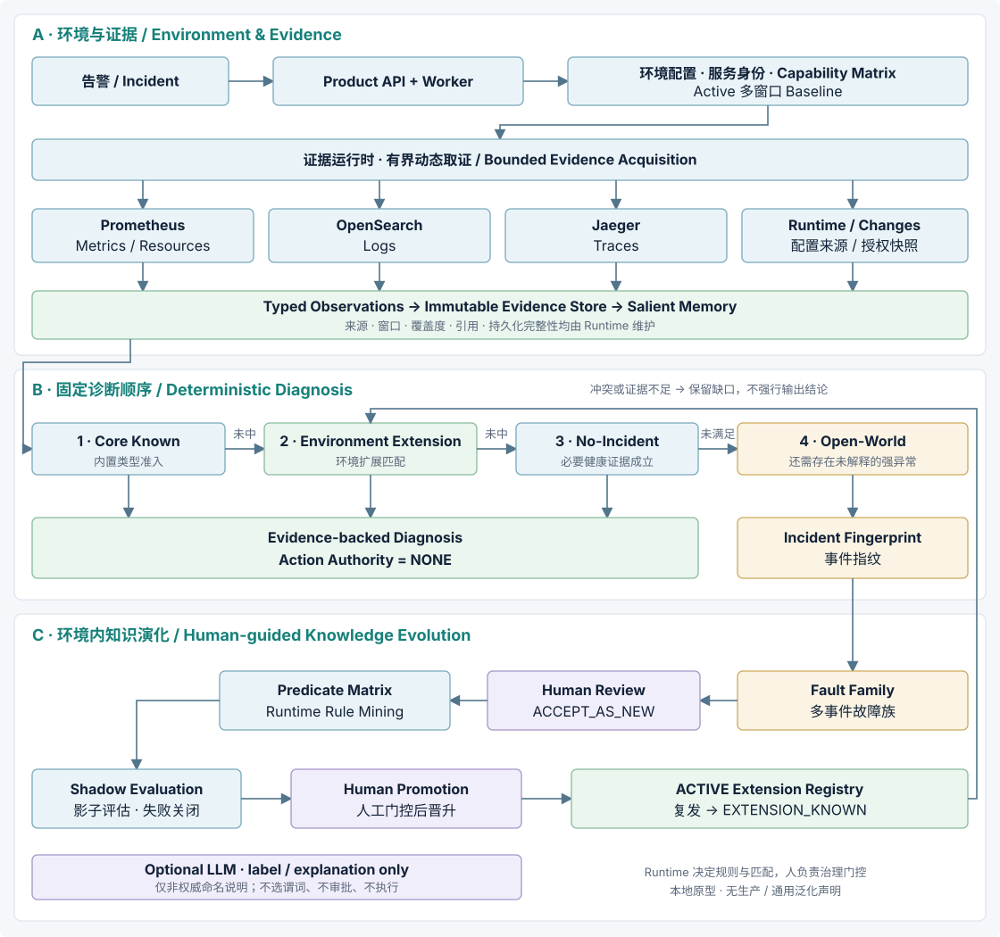

# 当前系统架构 · Product v0.3

三层结构：环境与证据、确定性诊断、人引导知识演化。
[当前结果](STATUS.md)与[限制](LIMITATIONS.md)定义公开能力边界。

[Mermaid 源文件](../assets/ecomsre-v03-architecture.mmd) ·
[离线手册](../interview/ecomsre-agent-v03-handbook.html)

## A · 环境与证据

环境登记 → 服务身份归一 → 连接器验证 → capability matrix →
Active 多窗口 Baseline → 有界读取 → Typed Observations → Immutable Evidence Store。

- 将遥测别名映射为稳定服务身份，避免同一服务被当成多个目标。
- 验证连接器并绑定能力矩阵；标签发现不等于每条查询都覆盖目标服务。
- 从历史窗口构建并显式激活 Baseline，事件绑定 Baseline、服务映射与能力摘要。
- Prometheus 提供 Metrics / Resources，OpenSearch 提供 Logs，Jaeger 提供 Traces；
  Runtime / Changes 来自配置的连接器或授权快照，不能假定每次完整。
- 有界读取保留窗口、来源、服务、失败状态与引用；失败或截断不代表没有异常。
- 规范化观测写入内容寻址 Evidence Store，Salient Memory 整理谓词支持证据。
  Runtime 检查引用、序列化与持久化绑定，解释文字不能替换原始观测。

取证入口：[read_backend.py](../../src/ecomsre/product/incidents/read_backend.py)；
接入细节见[连接器](CONNECTORS.md)与[Baseline](BASELINES.md)。

## B · 诊断

固定顺序：**Core Known → Environment Extension → No-Incident → Open-World**。
前层未得到准入结论才继续，证据冲突或不足时可以停止。

| 输出 | 含义 |
| --- | --- |
| `CORE_KNOWN` | 满足内置类型的证据支持与准入 |
| `EXTENSION_KNOWN` | 命中当前环境 ACTIVE 扩展 |
| `NO_INCIDENT` | 必要健康证据成立，不是以空结果替代健康 |
| `OPEN_WORLD` | 存在未被已知类型解释的强异常，生成临时报告 |
| `CONFLICTING_EVIDENCE` | 多重准入或冲突，不能强行选择答案 |
| `INSUFFICIENT_EVIDENCE` | 必要证据不足，不能推断健康或新机制 |

[ProductDiagnosisBridgeV1](../../src/ecomsre/product/incidents/diagnosis_bridge.py)
维护分路；Runtime 维护候选、谓词、覆盖度、支持引用、匹配、持久化完整性与权限。
Open-World 的领域和根服务是受证据约束的结果，不是普遍的因果发现保证。
所选领域没有唯一根服务时保留 `INSUFFICIENT_EVIDENCE`，决策轨迹记录
`OPEN_WORLD_ROOT_AMBIGUOUS`；保留支持证据，不生成临时报告或进入故障族。

孤立短窗口内存增长不能单独成为强残差，需要同服务独立佐证。
只有完整覆盖下的缺席才是负证据。
冻结 Core 规则与 Product 残差策略属于不同层，不应混为一次阈值调优。

## C · 知识演化

OPEN_WORLD report → Incident Fingerprint → 环境内 Fault Family →
Human ACCEPT_AS_NEW → Predicate Matrix → Runtime Rule Mining →
Shadow Evaluation → Human Promotion → ACTIVE Extension Registry。

[知识运行时](../../src/ecomsre/product/knowledge/runtime.py)
计算确定性加权指纹相似度、挖掘有界规则并运行影子评估；
[知识仓储](../../src/ecomsre/product/knowledge/repository.py)维护治理记录与扩展状态。
指纹包含异常类型、来源、根服务、领域、拓扑、运行/资源状态与归一化日志等，
不是文本 embedding，也不跨环境直接聚类。

可选 LLM 只提供标签或解释，不能选择晋升关键谓词、批准 Promotion 或执行动作。
[知识演化案例](KNOWLEDGE_EVOLUTION.md)说明实测与人工门控方式。
扩展生效后，新事件命中返回 `EXTENSION_KNOWN`；
多个扩展同时匹配进入冲突处理，不靠模型任选一个。

## 部署与持久化

[Product Compose](../../docker-compose.product.yml)包含两个 Python 进程和一个持久卷：

- FastAPI：API、鉴权、验证、稳定错误、health / readiness / metrics。
- Worker：SQLite 租约式后台任务，执行验证、Baseline、诊断。
- 数据卷：SQLite WAL 状态与内容寻址证据对象。

租约、重试计数及提交时 fencing 防止失效 Worker 发布结果。
重启复用同一数据，证据按摘要 create-once；
知识治理接口与后台诊断任务分开，不能仅凭路径中的 jobs 判断是否异步。

Product Compose 仅向 loopback 发布 API，不挂载 Docker socket，
进程非 root、只读根文件系统并有受限临时目录。
live 实验的独立控制器不是 Product/Agent 的执行权限。

接口 `/v1`、类型名 `V1`、SQLite schema 和包版本各有兼容性含义，
不会为公开 v0.3 标签改名。尚无 Kubernetes、HA、多租户或生产规模验证。
