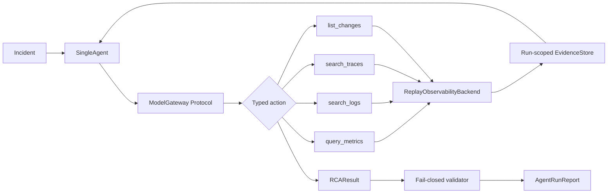

# Phase 1 Single-Agent RCA Replay Design

**Status:** Approved `PASS WITH FIXES` on 2026-07-31; mandatory amendments
incorporated

**Branch:** `phase1/single-agent-rca-replay`

**Base commit:** `9dc840e820009794f344e0a3fa5320d739cb6291`

## 1. Goal

Build the first EcomSRE-Agent diagnosis baseline:

```text
Incident
→ one Single Agent
→ dynamically selected Metrics / Logs / Traces / Changes typed tools
→ run-scoped Evidence Store
→ validated RCA_CONFIRMED / NEED_MORE_EVIDENCE / ABSTAIN
→ frozen replay evaluation
```

The implementation is replay-first and read-only. The same agent and tool
contracts may support a future live observability backend, but this phase does
not implement that backend.

## 2. Authority and isolation

This branch owns only the Phase 1 Agent track. Another worktree owns the Phase 0
run-invariant Compose hash repair.

The following paths and surfaces are immutable in this worktree:

- `src/ecomsre/environment/`
- `src/ecomsre/phase0/`
- `config/phase0/`
- Phase 0 historical run conclusions and live evidence
- image locks
- Docker lifecycle behavior
- Compose contracts

This phase also excludes:

- Multi-Agent behavior;
- Commander, specialist Agents, RCA Judge, or Remediation Planner;
- write-capable tools or automatic remediation;
- Docker or Compose execution;
- a live Prometheus, OpenSearch, Jaeger, or change-service HTTP backend;
- Kubernetes, AIOpsLab, UI, model training, LoRA, SFT, DPO, or RL.

The OpenAI-compatible model gateway is the only allowed real-provider
integration. It is explicit opt-in, obtains credentials only from environment
variables, does not run in the default smoke/evaluation/test path, and never
records a credential.

## 3. Selected architecture

The approved approach uses a strict internal action protocol between the Agent
and every model adapter. A model turn returns exactly one of:

- a typed Metrics action;
- a typed Logs action;
- a typed Traces action;
- a typed Changes action;
- a final typed `RCAResult`.

Provider-native response details do not leak into the Agent. The real
OpenAI-compatible gateway converts the internal prompt and action schemas into a
strict JSON request/response envelope. The deterministic adapter implements the
same gateway protocol without network access.



There is one Agent, one shared read-only tool registry, and one run-scoped
Evidence Store. No internal component is named or modeled as a Commander,
specialist Agent, Judge, Planner, or remediation component.

## 4. Package and file boundaries

### Core diagnosis

- `src/ecomsre/phase1/contracts.py`
  - all frozen Pydantic contracts;
  - decision and stable error enums;
  - model action discriminated union.
- `src/ecomsre/phase1/budgets.py`
  - immutable model/tool/token/deadline budgets;
  - run-scoped budget accounting.
- `src/ecomsre/phase1/evidence.py`
  - in-memory, run-scoped Evidence Store;
  - opaque reference allocation and lookup;
  - immutable report serialization.
- `src/ecomsre/phase1/validator.py`
  - final RCA and report validation;
  - fail-closed reference and semantic checks.
- `src/ecomsre/phase1/agent.py`
  - the single model/tool loop;
  - action dispatch, transcript construction, budget termination, and timing.
- `src/ecomsre/phase1/cli.py`
  - non-interactive replay smoke, evaluation, and opt-in provider smoke entry
    points.

### Typed tools

- `src/ecomsre/tools/base.py`
  - common tool context, timeout, stable error envelope, and backend Protocol.
- `src/ecomsre/tools/metrics.py`
  - `MetricsQuery` and `MetricsResult`;
  - `query_metrics`.
- `src/ecomsre/tools/logs.py`
  - `LogsQuery` and `LogsResult`;
  - `search_logs`.
- `src/ecomsre/tools/traces.py`
  - `TracesQuery` and `TracesResult`;
  - `search_traces`.
- `src/ecomsre/tools/changes.py`
  - `ChangesQuery` and `ChangesResult`;
  - `list_changes`.

### Backends and model adapters

- `src/ecomsre/backends/replay.py`
  - capability-bounded replay fixture loader;
  - `ReplayObservabilityBackend`.
- `src/ecomsre/backends/live_protocol.py`
  - future backend Protocol only;
  - no HTTP client or live implementation.
- `src/ecomsre/model/gateway.py`
  - model request, response, usage, and gateway Protocol;
  - OpenAI-compatible configuration and gateway.
- `src/ecomsre/model/scripted.py`
  - one generic deterministic evidence-driven policy;
  - no case IDs, expected answers, or ground-truth paths.

### Replay, evaluation, and configuration

- `config/phase1/agent.json`
  - strict JSON parsed with the standard library;
  - temperature `0`, model calls `8`, tool calls `8`, unified token budget,
    and per-call timeout.
- `config/phase1/replay-cases/agent-visible/<case-id>/`
  - agent-visible manifest, incident, and four backend fixture files.
- `eval/phase1/ground-truth/<case-id>.json`
  - evaluator-only expected decision/root service/fault mechanism.
- `eval/phase1/run.py`
  - frozen case runner and metric aggregation.
- `tests/phase1/`
  - unit, contract, leakage, and replay E2E tests.
- `.env.example`
  - variable names and placeholder values only.

The global Phase 0 CLI remains untouched. Make targets invoke
`python -m ecomsre.phase1.cli` directly, reducing merge conflict and authority
risk.

## 5. Core contracts

All core contracts use:

```python
ConfigDict(frozen=True, extra="forbid", allow_inf_nan=False)
```

All timestamps are timezone-aware UTC. Incident and query intervals are closed
UTC windows where `started_at <= ended_at`.

### Incident

- `incident_id`
- optional `alert_source_service`
- `summary`
- `started_at`
- `ended_at`
- `affected_sli`
- `severity`

The incident contains observed alert context only. It must not contain expected
root service, expected mechanism, scenario label, answer key, or evaluator path.
`alert_source_service` is non-authoritative alert-routing context, is empty in
most frozen cases, and may be wrong or distracting. It is never converted to
Evidence and cannot contribute to the independent-source threshold for
`RCA_CONFIRMED`.

### InvestigationRequest

- `run_id`
- `agent_id`
- `incident`
- `task_id`
- immutable budgets

### ToolCallRecord

- `call_id`
- `run_id`, `agent_id`, `incident_id`, `task_id`
- `tool_name`
- typed input
- stable status and error code
- UTC start/end plus monotonic duration
- evidence references returned

### Evidence

- `evidence_ref`
- `run_id`
- `source`: `METRICS | LOGS | TRACES | CHANGES`
- `service`
- `started_at`, `ended_at`
- `observation_type`
- structured `attributes`
- `raw_artifact_ref`
- `raw_artifact_sha256`
- `limitations`

Evidence is observation, not inference. Every reference has the form:

```text
evidence://<run_id>/<source>/<zero-padded-sequence>
```

It is allocated only by the current run's store. The store rejects replacement,
duplicate insertion, a mismatched run ID, a reference supplied by a tool, or a
raw artifact outside the selected case capability.

### Hypothesis

- `root_service`
- `fault_mechanism`
- `causal_chain`
- supporting and contradicting evidence references
- descriptions of observations still missing
- confidence

### RCAResult

- `decision`:
  `RCA_CONFIRMED | NEED_MORE_EVIDENCE | ABSTAIN`
- `root_service`
- `fault_mechanism`
- `causal_chain`
- `affected_sli`
- `supporting_evidence`
- `contradicting_evidence`
- `missing_evidence`
- `confidence`
- `decision_rationale`
- `recommended_next_action`

Decision semantics:

- `RCA_CONFIRMED` requires a non-empty root service, fault mechanism, causal
  chain, affected SLI, at least two supporting references from at least two
  evidence sources, and no unresolved required evidence.
- `NEED_MORE_EVIDENCE` requires non-empty missing evidence and a closed
  read-only next-action value; root service and mechanism may be absent or
  explicitly provisional.
- `ABSTAIN` requires no confirmed root service or mechanism and must state why
  the observed evidence does not establish a real incident.
- confidence is finite and in `[0, 1]`.
- `decision_rationale` is trimmed, non-empty, at most 1,000 characters, and
  explains why the selected decision follows from the observations. It cannot
  contain or encode a typed tool invocation, a shell command, or an Evidence
  reference, and it is never interpreted as Evidence.
- `recommended_next_action` is a closed read-only advisory string catalog. The
  provider must select one enumerated value, which serializes as its exact
  string; arbitrary provider-authored text is invalid. The catalog covers
  reviewing, inspecting, collecting, comparing, preserving, retaining,
  requesting, examining, validating, correlating, monitoring, documenting,
  awaiting, and requesting service-owner review of read-only evidence. This
  structural boundary prevents the field from encoding a tool invocation,
  shell command, mutation, or remediation execution.

`supporting_evidence` and `contradicting_evidence` contain Evidence Store
references. `missing_evidence` contains bounded natural-language descriptions
of observations that do not exist yet; they are not references and cannot be
used as support.

### AgentRunReport

- request identity and model configuration without secrets
- final decision and validated `RCAResult`
- ordered model-call and tool-call records
- complete evidence index
- model/tool/token budget usage
- UTC and monotonic latency
- terminal status and stable reason
- schema validity and evidence-reference validity

## 6. Typed tool contract

Each tool owns an independent Pydantic input/output schema. A common tool context
contains the authenticated in-process incident window, backend capability,
Evidence Store, timeout, and remaining call budget.

Every tool:

1. validates its requested interval is wholly inside the incident interval;
2. consumes one tool-call budget before backend dispatch;
3. enforces its timeout through the backend call contract;
4. converts backend rows into structured Evidence;
5. stores Evidence and returns only store-allocated references;
6. retains a case-relative raw replay artifact reference and hash;
7. returns one of the stable errors:
   - `INVALID_QUERY`
   - `OUTSIDE_INCIDENT_WINDOW`
   - `TIMEOUT`
   - `BUDGET_EXHAUSTED`
   - `BACKEND_UNAVAILABLE`
   - `MALFORMED_REPLAY_ARTIFACT`
   - `INTERNAL_CONTRACT_VIOLATION`

No tool accepts a filesystem path, URL, shell command, Docker identifier, write
payload, or arbitrary backend name.

## 7. Replay backend and fixture boundary

`ReplayObservabilityBackend` implements the same read-only Protocol expected of
a future live backend:

- `query_metrics(MetricsQuery) -> MetricsResult`
- `search_logs(LogsQuery) -> LogsResult`
- `search_traces(TracesQuery) -> TracesResult`
- `list_changes(ChangesQuery) -> ChangesResult`

The fixture loader receives a single allowlisted
`config/phase1/replay-cases/agent-visible/<case-id>` capability. It:

- resolves and verifies the capability root once;
- rejects symlinks, non-regular files, traversal, absolute paths, and unexpected
  files;
- loads only `manifest.json`, `incident.json`, `metrics.json`, `logs.json`,
  `traces.json`, and `changes.json`;
- verifies declared SHA-256 values;
- does not accept or derive an evaluator root;
- returns immutable validated models, not open paths.

The Agent and its dependencies never import `eval.phase1`, never receive an
evaluator path, and never open files during a run. The evaluator loads ground
truth only after `AgentRunReport` has been returned and validated.

## 8. Model gateway

### Protocol

Every adapter implements:

```python
complete(ModelRequest) -> ModelResponse
```

`ModelRequest` includes the allowed action schemas, incident, compact transcript,
current Evidence index, and remaining budgets. `ModelResponse` includes exactly
one typed action, token usage, provider/model identifiers, and latency.

### Deterministic scripted adapter

The deterministic adapter is a single generic evidence-driven state machine. It
does not load per-case scripts and does not branch on case ID.

Its frozen policy is:

1. start with Metrics;
2. if metrics do not establish an SLI anomaly, inspect Changes and then abstain;
3. if metrics establish an anomaly, inspect Traces;
4. inspect Logs when trace or metric evidence needs textual attribution;
5. inspect Changes to test a deployment/change hypothesis and decoys;
6. confirm RCA only when at least two independent sources establish the same
   root service and mechanism;
7. return `NEED_MORE_EVIDENCE` when required correlation remains absent;
8. return `ABSTAIN` when the SLI is normal or evidence contradicts a real
   incident.

This policy produces different tool sequences based on returned Evidence, which
proves dynamic selection without exposing evaluator answers.

The mechanism named by the policy cannot be more specific than the cited
observations. Metrics plus Traces may confirm a request-path, dependency, cache,
or latency mechanism only when both sources visibly establish it. A runtime
configuration failure requires independent Changes evidence or another
verifiable source that records the configuration transition; it cannot be
inferred from an error-rate metric and a failing span alone.

### OpenAI-compatible gateway

The real provider adapter:

- reads only `ECOMSRE_LLM_BASE_URL`, `ECOMSRE_LLM_API_KEY`, and
  `ECOMSRE_LLM_MODEL`;
- requires HTTPS except an explicitly local test transport;
- sends temperature `0` and strict JSON action instructions;
- uses a per-call timeout;
- parses and validates the response into the same action union;
- records model name, token usage, latency, and stable error code;
- never writes or logs the API key, authorization header, or raw credential
  environment;
- has no retry by default, avoiding hidden budget expansion;
- is not used by pytest, replay smoke, or frozen evaluation;
- is used only by the explicit `phase1-provider-smoke` command, which runs at
  least one frozen `RCA_CONFIRMED` case and one frozen `ABSTAIN` or
  `NEED_MORE_EVIDENCE` case through the real configured gateway.

`.env.example` contains names and placeholders only. `.env` and `.env.*` remain
ignored except `.env.example`.

## 9. Agent loop and termination

The Agent loop:

1. validates `InvestigationRequest`;
2. initializes run-scoped budgets, transcript, and Evidence Store;
3. asks the model for one action;
4. validates the action and identity;
5. dispatches one allowed tool or receives a final RCA;
6. appends the typed call record and observations;
7. repeats until a valid final RCA or a terminal budget/error condition;
8. runs the fail-closed validator;
9. emits `AgentRunReport`.

Defaults:

- temperature: `0`
- maximum high-level model calls: `8`
- maximum tool calls: `8`
- one unified token budget per run
- one timeout per model and tool call

Budget exhaustion cannot silently increase limits. If the current evidence can
support a valid non-confirming result, the run returns
`NEED_MORE_EVIDENCE`; otherwise it terminates with a stable invalid-run status.

## 10. Fail-closed validation

The validator proves:

- the final object matches `RCAResult`;
- every evidence reference resolves in the current store;
- every reference belongs to the current run;
- supporting and contradicting reference sets do not overlap;
- `alert_source_service` is never counted as or converted into Evidence;
- missing-evidence descriptions are non-empty, bounded, and never interpreted
  as references;
- `decision_rationale` is non-empty, bounded, decision-consistent, contains no
  Evidence reference, tool invocation, or shell command, and is never counted
  as Evidence;
- `recommended_next_action` is exactly one enumerated read-only advisory string;
  arbitrary strings are rejected by schema validation before they could encode
  tool, shell, mutation, or remediation execution;
- decision-specific fields and evidence diversity are satisfied;
- the affected SLI is compatible with the Incident;
- the final report's tool records and evidence index agree;
- tool/model/token counts do not exceed budgets;
- there is no write tool or unsupported tool name;
- no evaluator-only semantic or path marker appears in Agent-visible records.

One unresolved reference makes the report invalid. The validator does not delete
the bad output or replace it with a plausible answer.

## 11. Frozen replay cases

At least these seven cases are frozen:

1. `ad-partial-failure-complete`
   - abnormal ad request/error metrics;
   - ad error traces and logs;
   - supporting sanitized ad change;
   - expected `RCA_CONFIRMED` for a runtime configuration failure supported by
     the independent Changes evidence.
2. `ad-partial-failure-without-logs`
   - abnormal metrics and ad error traces;
   - logs backend returns stable unavailable evidence;
   - expected `RCA_CONFIRMED` for the narrower request-processing failure
     mechanism actually established by Metrics and Traces.
3. `ad-partial-failure-frontend-decoy`
   - ad failure evidence plus unrelated frontend change;
   - `alert_source_service` is the incorrect, distracting `frontend` hint;
   - expected ad RCA with the decoy present in the Evidence Store but absent
     from supporting evidence;
   - the decoy is not required to appear as contradicting evidence.
4. `ad-change-with-normal-sli`
   - sanitized ad change but normal business metrics and no failing traces;
   - expected `ABSTAIN`.
5. `telemetry-insufficient`
   - alert context but insufficient cross-source attribution;
   - expected `NEED_MORE_EVIDENCE`.
6. `no-real-incident`
   - normal metrics, normal traces/logs, no causal change;
   - expected `ABSTAIN`.
7. `recommendation-cache-failure`
   - abnormal recommendation cache/error metrics;
   - recommendation traces and logs visibly establish cache backend timeouts;
   - expected `RCA_CONFIRMED` with root service `recommendation`;
   - no Changes evidence is needed because the claimed mechanism is a
     cache/dependency timeout, not a runtime configuration failure.

At least five of the seven Incident objects have
`alert_source_service = null`. No `RCA_CONFIRMED` result may cite the hint as
support, and confirmed root services are not all `ad`.

Agent-visible fixtures never contain `expected_decision`, `expected_root_service`,
`expected_fault_mechanism`, scenario truth, or a ground-truth reference.
Evaluator-only ground truth may additionally identify decoy observation
selectors and the evidence-supported mechanism granularity. Those selectors are
loaded only after the validated Agent report exists.

## 12. Evaluation

`phase1-eval` runs all cases non-interactively with the deterministic adapter and
reports:

- Decision Accuracy
- Schema Valid Rate
- Root Service Accuracy
- Fault Mechanism Accuracy
- Evidence Reference Validity
- Abstention Accuracy
- Decoy Resistance
- Average Tool Calls
- Token Usage
- Wall-clock Latency

Accuracy denominators are explicit:

- decision accuracy uses every case and requires the exact expected decision;
- root service and mechanism accuracy use cases whose ground truth requires
  `RCA_CONFIRMED`;
- abstention accuracy uses `NEED_MORE_EVIDENCE` and `ABSTAIN` cases and requires
  the exact expected decision;
- schema and evidence-reference validity use every case;
- decoy resistance uses cases with evaluator-declared decoys and requires the
  correct decision/root service plus absence of matched decoy Evidence from
  `supporting_evidence`. A decoy need not be listed in
  `contradicting_evidence`.

Every accuracy/rate metric includes raw numerator and denominator counts.
Aggregate tool calls, provider-reported tokens, and wall-clock latency include
per-case values plus totals/averages as applicable. The report includes all
case-level results.
Timing is descriptive for the local scripted replay only and is not a model
performance or production latency claim.

## 13. Non-interactive commands

The Makefile adds:

```text
make phase1-replay-smoke
make phase1-eval
make phase1-test
make phase1-provider-smoke
```

- `phase1-replay-smoke` executes one complete frozen case:
  load → Agent → typed tools → Evidence Store → validator → run report.
- `phase1-eval` executes all frozen cases and writes/prints the evaluation
  report.
- `phase1-test` runs only `tests/phase1/`.
- `phase1-provider-smoke` is an optional, explicit real-provider integration
  check and is never invoked by pytest or the three default offline targets. If
  any required provider setting is absent, it prints the exact terminal status
  `SKIPPED_NOT_CONFIGURED` and exits successfully without opening a network
  connection. When configured, it must produce valid reports for at least one
  `RCA_CONFIRMED` case and one `ABSTAIN` or `NEED_MORE_EVIDENCE` case before it
  prints `PASSED`.

All targets use project-local cache and temporary directories, require no user
prompt, and do not invoke any Phase 0, Docker, Compose, or live observability
command. Only `phase1-provider-smoke` may invoke the explicitly configured
OpenAI-compatible model endpoint.

Runtime results are written only below the existing Git-ignored
`artifacts/phase1/` root:

- `artifacts/phase1/reports/<run-id>/agent-run-report.json`
- `artifacts/phase1/evaluation/evaluation-report.json`
- `artifacts/phase1/provider-smoke/provider-smoke-report.json`

Both files are strict machine-readable JSON. The commands also print a compact
JSON summary to stdout and return nonzero when schema validation, evidence
reference validation, case execution, or evaluation aggregation fails.

## 14. Test strategy

Implementation follows test-first RED → GREEN → REFACTOR cycles.

Required test groups:

- contract construction and invalid-field rejection;
- decision-specific `RCAResult` semantics;
- optional/non-authoritative alert source and decision-rationale validation;
- missing/cross-run Evidence reference rejection;
- incident-window enforcement for every tool;
- backend timeout and stable error mapping;
- replay path, symlink, unexpected-file, and hash rejection;
- Agent inability to access evaluator-only answers;
- deterministic policy dynamic tool selection;
- model/tool/token/deadline budget enforcement;
- OpenAI gateway configuration, request, response, and credential-redaction
  tests using an injected local fake transport;
- provider-smoke skip/configured orchestration tests using the injected
  transport, without calling a real provider from pytest;
- seven case-level E2E tests, including cross-service RCA and misleading hint;
- evidence-supported fault-mechanism granularity tests;
- decoy presence, non-support, and Decoy Resistance tests;
- evaluation metric numerator/denominator tests;
- Make target and no-write-tool contract tests;
- protected-path diff guard.

Final verification includes:

- `make phase1-test`
- `make phase1-replay-smoke`
- `make phase1-eval`
- `make phase1-provider-smoke` with provider settings absent, expecting
  `SKIPPED_NOT_CONFIGURED`
- full offline pytest
- Python compileall
- `git diff --check`
- protected Phase 0 tree/hash comparison against base commit
- search proving no Multi-Agent, Commander, Judge, Remediation, Docker, Compose,
  or observability live HTTP implementation entered Phase 1 code

## 15. Documentation state

To avoid conflict with the sibling Phase 0 worktree, implementation does not
modify `docs/ROADMAP.md`, `docs/ARCHITECTURE.md`, `docs/OPEN_QUESTIONS.md`, or
`docs/PROJECT_CHARTER.md`. The Phase 1 design, final Human Brief, and validation
report record the explicit replay authorization and actual implemented state.
They must continue to state:

- Phase 0 is incomplete;
- formal three-cycle acceptance was not executed;
- the historical Phase 0 verdicts were not rewritten;
- Phase 1 does not repair or depend on live Phase 0 integration;
- Phase 2 Multi-Agent work remains unimplemented.

The required L2 Human Brief is derived after implementation and fresh
verification. It is not an authority source and cannot upgrade the verdict.

## 16. Requirement-to-evidence matrix

Completion is judged from the following authoritative artifacts and fresh
checks. A narrative statement or green test outside this matrix cannot replace
the named evidence.

| Requirement or boundary | Authoritative artifact | Required verification |
| --- | --- | --- |
| Work starts from the preserved Phase 0 Draft PR state | Git base commit and current branch ancestry | Confirm the branch is `phase1/single-agent-rca-replay`, its base includes `9dc840e820009794f344e0a3fa5320d739cb6291`, and PR #1 remains Draft and unmerged |
| Phase 0 protected areas are untouched | Git trees/blobs for `src/ecomsre/environment/`, `src/ecomsre/phase0/`, `config/phase0/`, the image lock, historical evidence, Compose contract tests, and lifecycle tests | Compare the recorded base hashes and require an empty protected-path diff |
| Strict incident, tool, evidence, model-action, and RCA contracts | `src/ecomsre/phase1/contracts.py` and contract tests | Construct every valid contract; serialize every closed `recommended_next_action` catalog value to its exact string; reject extra fields, invalid enums, arbitrary recommended actions, malformed windows, invalid decision semantics, overlong/empty rationale, and rationale containing refs, tools, or shell |
| Alert routing context is optional and non-authoritative | Incident fixtures, contracts, Evidence index, and case assertions | Require at least five null hints, one incorrect `frontend` hint, zero hint-derived Evidence, and unchanged two-source confirmation rules |
| One Agent owns four independent read-only typed tools | Agent/tool modules plus run reports | Contract tests prove only Metrics, Logs, Traces, and Changes exist; each successful run records typed tool calls and no write-capable action |
| Tool choice is dynamic rather than a fixed all-tools pipeline | Deterministic policy tests and per-case `tool_calls` in reports | Assert evidence-dependent call sequences differ across cases and that at least one valid case omits an unnecessary tool |
| Every supporting or contradicting evidence reference is verifiable | Run-scoped Evidence Store and serialized evidence records | Negative tests reject unknown, cross-run, malformed, overlapping, and unpersisted refs; all seven reports resolve every cited ref |
| Replay fixtures are the only observability backend used | Agent-visible case manifests/files and replay-loader tests | Reject absolute paths, traversal, symlinks, unknown files, hash mismatch, and any backend outside the case root |
| Evaluator answers remain hidden from the Agent | Separate `eval/phase1/ground-truth/` tree | Static dependency/path scan plus runtime leakage tests prove Agent, tools, backend, and scripted model cannot import or read evaluator-only files |
| Pytest, smoke, and evaluation never require an API | Deterministic scripted adapter and subprocess tests | Clear model environment variables, deny network transport, and run all three Make targets successfully |
| A real model can use an OpenAI-compatible gateway without a committed key | Gateway adapter, `.env.example`, injected-transport contract tests, and provider-smoke report | Verify opt-in configuration, request/response parsing, deterministic request settings, bounded timeout, no retry, HTTPS policy, credential redaction, exact unconfigured skip, and configured two-decision smoke orchestration |
| Calls, tokens, tool executions, and elapsed time are bounded and observable | Budget policy and machine-readable run reports | Unit tests force each limit and assert stable failure codes, model call IDs, tool call IDs, token accounting, and monotonic duration fields |
| The seven required frozen scenarios span services and mechanisms | Seven paired agent-visible case manifests and evaluator-only ground-truth files | Pair-count/hash checks, seven E2E assertions, a non-`ad` confirmed root, and visible-evidence mechanism checks |
| Frontend decoy does not steer or falsely support the RCA | Decoy fixture, evaluator selector, evidence index, and case result | Assert the decoy is stored, absent from supporting refs, does not alter the `ad` root, and passes case-level Decoy Resistance without requiring it in contradicting refs |
| Evaluation reports all requested metrics from frozen ground truth | `artifacts/phase1/evaluation/evaluation-report.json` | Assert all ten named metrics, raw numerators/denominators for rates, case coverage, and deterministic rerun equality |
| Required default workflows are non-interactive and replay-only | `phase1-replay-smoke`, `phase1-eval`, and `phase1-test` Make targets | Execute all three with Docker unavailable, model credentials cleared, and no prompt or external network dependency |
| Optional provider workflow is truthfully gated | `phase1-provider-smoke` and its machine-readable report | Without settings require `SKIPPED_NOT_CONFIGURED`; with settings require one validated confirmed and one validated non-confirmed case before provider readiness |
| No Multi-Agent, Commander, Judge, Remediation, training, Docker lifecycle, Compose, or live observability HTTP work enters this branch | Phase 1 source/config/test diff | Static search, import inspection, protected hash comparison, and changed-file review must all pass |
| The L2 review surface is evidence-derived | `docs/human-briefs/2026-07-31-phase1-single-agent-rca-replay.html` | Confirm it links the machine-readable run/evaluation evidence and preserves Phase 0 incomplete and Phase 2 unimplemented boundaries |
| Final status uses exact truth markers | Fresh verification outputs and the final handoff | Report the fixed field order below; emit pipeline readiness after offline gates, upgrade to MVP readiness only after the real provider gate, otherwise emit BLOCKED with the failed gate |

## 17. Completion verdict

The implementation may report:

```text
PHASE1_REPLAY_PIPELINE_READY
```

only when all seven scripted replay cases execute, all requested metrics are
reported, the three default Make targets pass, the unconfigured provider target
returns `SKIPPED_NOT_CONFIGURED`, the fail-closed reference tests pass, the full
offline suite passes, and protected Phase 0 paths match their recorded base
hashes.

The stronger verdict:

```text
PHASE1_SINGLE_AGENT_REPLAY_MVP_READY
```

requires every pipeline-ready condition plus a real configured
OpenAI-compatible provider smoke that produces and validates at least one
`RCA_CONFIRMED` result and at least one `ABSTAIN` or `NEED_MORE_EVIDENCE`
result. Injected transports and pytest doubles cannot satisfy this stronger
gate.

Otherwise the verdict is:

```text
BLOCKED
```

with the exact failed gate and no Phase 0 or Multi-Agent scope expansion.

The final handoff uses this exact field order:

```text
Verdict: PHASE1_REPLAY_PIPELINE_READY / PHASE1_SINGLE_AGENT_REPLAY_MVP_READY / BLOCKED

Branch:
Base commit:
Files changed:
Agent:
Tools:
Replay cases:
Model configuration:
Tests:
Replay smoke:
Evaluation results:
Phase 0 modified:
Multi-Agent work:
Known limitations:
Recommended next step:
```

These two lines are fixed:

```text
Phase 0 modified: No historical verdict or live evidence rewritten
Multi-Agent work: None
```

On success, the recommended next step is recorded exactly as:

```text
Phase 2: replace the single all-tools agent with Commander plus
Metrics, Logs, Trace and Change specialist agents under the same replay suite.
```

That recommendation is future work only. This Phase 1 branch does not create
any Phase 2 code, placeholder, interface, or package.
